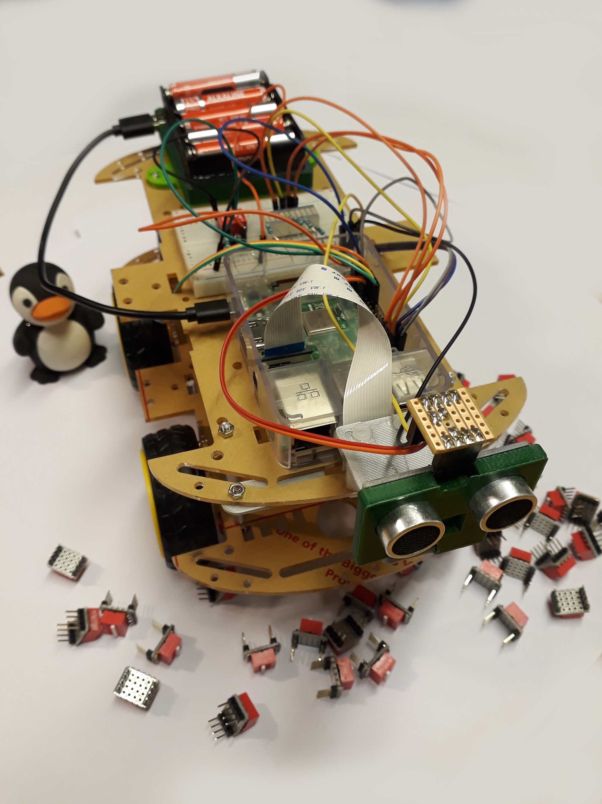

An Octave/MATLAB powered Raspberry PI robot buggy
=================================================

This repository contains all the source code and teaching material needed to build and construct an octave/MATLAB powered Raspberry PI robot buggy with acoustic sensors for distance sensing and a camera for object detection.  It runs off 9 AA cells, has a built in voltage regulator and a 3D printed camera bracket.

- *[Work sheet 0](https://github.com/roderickmackenzie/matlab_robot_buggy/blob/master/WS0/worksheet.md)* : The buggy emulator (for when COVID shuts down the lab)
- *[Work sheet 1](https://github.com/roderickmackenzie/matlab_robot_buggy/blob/master/WS1/worksheet.md)* : Building the buggy
- *[Work sheet 2](https://github.com/roderickmackenzie/matlab_robot_buggy/blob/master/WS2/worksheet.md)* : Introduction to Octave on the PI
- *[Work sheet 3](https://github.com/roderickmackenzie/matlab_robot_buggy/blob/master/WS3/worksheet.md)* : Output, controlling the motors and LEDs
- *[Work sheet 4](https://github.com/roderickmackenzie/matlab_robot_buggy/blob/master/WS4/worksheet.md)* : Input, echo sensors, switches and cameras.
- *[Work sheet 5](https://github.com/roderickmackenzie/matlab_robot_buggy/blob/master/WS5/worksheet.md)* : Image recognition
- *[Work sheet 6](https://github.com/roderickmackenzie/matlab_robot_buggy/blob/master/WS6/worksheet.md)* : The buggy challenge, an obstetrical course for the buggies.

Time taken to build/do the work sheets
--------------------------------------

This project is meant to take 1st year mechanical engineering undergraduate students 4x4hr sessions over 4 weeks.

License
-------
This buggy building workshop was originally run in Feb 2018, and rewritten in Feb 2020 at the University of Nottingham, UK.  I will be pleased if other students can benefit from the lab.  I therefore release the source code in this repository under the 3-clause [BSD license](https://en.wikipedia.org/wiki/BSD_licenses).  I release the documents under the under [CC-BY](https://creativecommons.org/licenses/by/2.0/).   If you do end up reusing this material do drop me a mail/post card.

Roderick MacKenzie 29/3/2020
