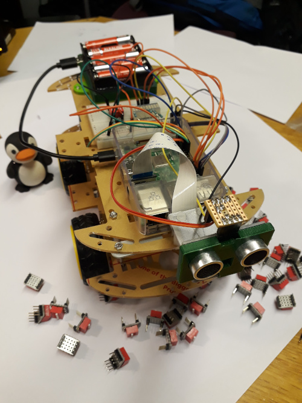
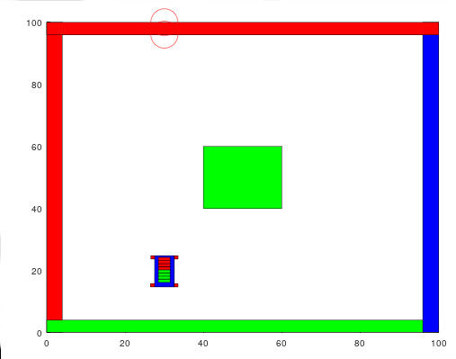

Lab 0 - The MATLAB robot buggy
===========

Introduction
----------
This lab was originally introduced to give 1st year mechanical engineering at students Nottingham a taste of how to use computers to control hardware and how to make computers interact with the real world (See figure 1).  Unfortunately, between March 2019 and now, there was a global pandemic, this makes it hard to run large group labs with 300+ students in them.  Added to this the robots are fairly complicated devices (see below) with lots of wires which would be very hard to clean between labs.  I therefore had to come up with a virtual lab which gives you most of the experience of the real lab but in a safe (and hopefully fun!) way.  I have written a buggy simulator and a virtual environment which which enables you to simulate the actions of the buggy in matlab.  The only thing you will miss out on is the actual screwing together of the buggy, which is a real shame but it was more a fun exercise rather than anything where you learnt a great deal.  The virtual lab will enable all other objectives to be met.

Figure 1: The robot assembled with Mr. Penguin giving a helping hand.

Emulators in the real world
------------------

In the real world you often need to write [emulators](https://en.wikipedia.org/wiki/Emulator), to simulate a piece of equipment or computer system.  You may have to do this because ;1) the real equipment is not yet developed - think of writing code for a new mobile phone chip which has not yet been fabricated ;2) the equipment is [too old so does not exist any more](http://www.emulator-zone.com/doc.php/nes/) such as a Nintendo emulator to run your old sonic the hedgehog games (this [channel](https://www.youtube.com/watch?v=4BlpONgj74A) is very good if you are into that sort of thing); 3) Or because testing your device out in the real world is too expensive.  An example of the latter is in developing automated driving systems.  It's far quicker (and safer!) to test your new machine learning algorithms out on a virtual world than let them drive around a real car.  Usually, one uses an emulator to develop the code for a product, then moves onto the real hardware once available.  Very often before making an actual product a software emulator will be developed to test out ideas in product development.  In our scenario, it's just not a good idea at the moment to have 300 people together in a room.

The buggy emulator
-----------------
You can download the buggy emulator from [here](https://github.com/roderickmackenzie/matlab_robot_buggy/tree/master/buggy_simulator), (note: I will make this available by the first lab sesson) download the zip file and unzip it on your PC in an empty directory.  I would recommend on your desktop.  You can look around and edit the code it is just MATLAB, you should be able to understand most of it.  Open the file called *autorun.m* and press play.  You should see a robot buggy appear on the screen and start moving around.

Figure 2: The buggy emulator.

Doing this lab with the emulator
-----------------
Just as you would have to in the real world if you were developing a product, I am going to give you the emulator and the *real* lab sheets which are deliberately *unchanged* from the previous years labs.  It is your job to get through the labs and do the tasks with the emulator.  This is exactly what you would have to do if you were using an emulator to develop a real world product, the only difference being that in industry you would probably get a chance to test your code on the real hardware at the end of the project.  Read though all the experimental sections of the lab sheets so you understand what is going on just as if you were going to build the buggy.  As ever I will be helping you get through the example sheets, with a team of demonstrators.

Going further on your own
-----------------
The computer the buggy is based around is called the Rasbry PI, it is a very low cost computer which you can get from Amazon or RS for about 30 pounds.  If you find this lab fun and want to go further, I highly recommend you get one.  It's a very good entrance into the world of home automation, robotics, and even writing code in C/Linux.  This year (due to Covid) I would recommend this more than usual.  Spending significant time 'hacking' on the PI will probably teach you far more than I can teach you in a semester of computing lectures.

Preparation work
----------
Some of the programming concepts, you will need during the buggy session such as classes we have not covered in the lectures yet.  Therefore before you begin the buggy session, please find the lectures called "Self study prep material - lecture 1"/"Self study prep material - lecture 2" on moodle and go through them.  Then work your way through the work sheets associated with the lectures.  The fist lecture is effectively a warm up exercise refreshing much of what we covered during the first semester, and the second work sheet introduces the concept of classes. Bring any questions you may have to the first on-line buggy session.  You will need to be good at classes and functions to get through the buggy sessions.  Note: These lectures have been straight copied from an advanced MATLAB course I give the 2nd year aerospace class, so just ignore anything which is to do with that module - they are effectively just advanced MATALB lectures. You will have to upload the answers to the associated preparation work sheets with the answers for Lab 1.  Note: I am not expecting you to answer every question in the work sheets, just have a good go at them and use them as a warm up exercise to this set of labs.

Plagiarism
----------
If you are doing the virtual lab, **this series of labs is individual work not group work.. the usual plagiarism rules apply...**

Assessment
----------
For each of the four work sheets associated with this lab,  there are some questions to work through, these will be *marked* by the demonstrators and you will get given a mark out of 100%.  The buggy is worth 35% of this module.  To get the marks for the work sheets you will ALSO have to have also handed in the *Preparation work* see above. For each lab you will have to upload a zip folder containing what you have done.

On to Lab 1
-----------------
[Lab 1>](https://github.com/roderickmackenzie/matlab_robot_buggy/blob/master/WS1/worksheet.md)
