Lab 1
===========
Introduction
----------
This series of four labs will take you through the process of building a computer controlled robot buggy.  In essence there are two parts to the buggy.  The mechanical buggy with it’s motors, gear boxes and wheels, and the electronic system which controls the buggy.  Our buggies will be controlled by a Raspberry PI computer.  This is a fully fledged computer on a single board, it uses the same type of powerful [microprocessors](https://en.wikipedia.org/wiki/ARM_architecture) which are in your mobile phone.  It has screen output, USB ports, Network ports, WiFi and everything you would expect from a normal desktop computer.  It is my hope that by introducing you to this computer early on in your degree, you will be able to use it in your projects later, or indeed use it in your own projects at home.  First we are going to configure the Raspberry PI computer, then we are going to build the buggy.

Your robot buggy kit
-----------------
The robot buggy kit is sown in figures 1 and 2.  Figure 1, shows how the components should be stored in the toolbox, and figure 2 includes the larger components which will not fit in the box.  When you return your buggy at the end of the buggy building sessions, all the components should be placed into the toolbox exactly as you found them.

Figure 1: The robot buggy kit in it's toolbox, when you return your buggy kit, it should be set out in exactly the same way as you got it.

Figure 2: The robot buggy kit spread out on a table, including larger components which will not fit in the box.

Your box should contain:
|  Item              |  Number  	| Provider  |  Order code |
| ------------------ | -------- 	| --------  | -------- |
|  Wheels            |  x4      	| Amazon |  |
|  Screwdriver       |  x1      	| RS |  |
|  Posts 			 |  x4      	| RS |  |
|  Yellow motors 	 |  x4      	| Amazon |  |
|  Black USB wire 	 |  x1      	| Amazon |  |
|  Pre-made motor wire |  x1    	| UoN |  |
|  Raspberry PI |  x1           	| RS |  |
|  Acoustic sensor   |  x1      	| Amazon |  |
|  Wires             |  lots    	| Amazon |  |
|  Acoustic sensor holder | x1  	| UoN |  |
|  L298 motor driver board | x1  	| Amazon |  |
|  Red dipswitches | x1  			| RS |  |
|  LED bar graph | x1  				| RS |  |
|  Acoustic sensor interface | x1  	| UoN |  |
|  Camera holder | x1  				| UoN |  |
|  Camera+ribbon cable | x1 		| RS |  |
|  Raspberry PI enclosure | x1		| RS |  |
|  330 Ohm resistors 	  | x4		| RS | 125-1157 |

It should also contain the following number of bolts and nuts:

|  Item              |  Number  	|  	Provider  |  Order code |
| ------------------ | -------- 	|   --------  | -------- |
|  Motor supports screws   |  x8    |  |  |
|  Long metal screws |  x8       	|  |  |
|  Plastic screws M3 short  |  x2   |  |  |
|  M3 plastic nuts       |  x5      |  |  |
|  M3 nuts           |  x18      	|  |  |
|  Plastic hex supports long (15mm) |  x2 | Rapid/RS | 33-2044/102-6520 |
|  Plastic hex supports short |  x4 |  |  |
|  Plastic screws M3 long  |  x3    | RS | 527-987 |
|  Long metal M3 screw for sensor |  x1 | RS |  560-647*     |

Section 1: Constructing the top of the buggy
--------------------------------------------

**Step 1**: Locate:
* The top plate to the buggy, this is a brown piece of acrylic with a white thing stuck to it (this white thing is called a bread board).
* The case for the raspberry PI, this is clear acrylic box, which comes in 2/3 parts
* A long *PLASTIC* screw and a *PLASTIC* washer.

These components are shown in figure 3.   If you do not have any of these components go and ask a demonstrator for them.  *Do not use a metal screw this will short the PI and destroy it.*

Figure 3: The top bottom half of the PI case, fixed to the top of the buggy.

Hold the top plate to the buggy in your hands, and notice that the breadboard is slightly offset from the center of the board, arrange the bottom of the PI case and the top of the buggy so that it looks like Figure 3.  Then take the long screw and pass it though one of the large holes in the PI case, until it pokes out the other side.  Then pass the screw though a hole in the top plate to the buggy and fasten it in place with the nut.  The result should look like Figure 3, if something does not fit, don't force it ask a demonstrator for help.

**Step 2:** Locate the [raspberry PI](https://en.wikipedia.org/wiki/Raspberry_Pi) in your toolbox.  When handling the raspberry pi, it is important to note that you are directly handling the circuit board of a computer.  Circuit boards are very delicate, and can be damaged by moisture form your hands and static electricity from your body.  It is also important to note that all the metallic bits on the back of the board will have electricity running through them, (so I would not recommend licking them!), so it is important you don't place the raspberry PI on any metallic objects such as metal pens, rulers, coins etc... Locate the SD card in your kit (the demonstrators may will have these), and insert the SD card into the PI as shown in figure 4.  The SD card acts as the internal hard disk for the PI, it contains both the operating system ([Raspbian which is a version of Linux](https://www.raspberrypi.org/downloads/raspbian/)), and acts a place to store your work.

Figure 4: Inserting the SD card into the PI.

**Step 3:** Insert the PI into the base of the case. See figure 5.  Note there is a little slot for the SD card to poke out of on the right of the case.  If it does not fit, don't force it ask for help.

Figure 5: The PI inserted into the case.

**Step 4:** Find the top of the PI case and clip it on over the rest of the PI.  This plastic case protects most of the circuit board but leaves the IO (Input/Output) pins exposed.  This is shown in figure 6.

**Step 5:** Find the two short hex spacers, and two long hex spacers, as shown in figure 6.  Screw these together and insert them into the front of the buggy as shown in figure 7, fasten the hex spacers in place with two plastic nuts.

Figure 6: Building the legs for the ultrasonic sensor. 

Figure 7: Attaching the legs for the ultrasonic sensor to the buggy, using two **plastic** nuts.

**Step 6:** Now find the 3D printed holder for the ultrasonic range finder in your tool kit.  You will also need a long M3 bolt and screw, build together the holder as shown in figure 8.  (Hint you might need to borrow a second screwdriver form you neighbor to tighten the nut).  Once the sensor holder is screwed together, screw it to the hex spacers as shown in figure 9, using long PLASTIC screws.

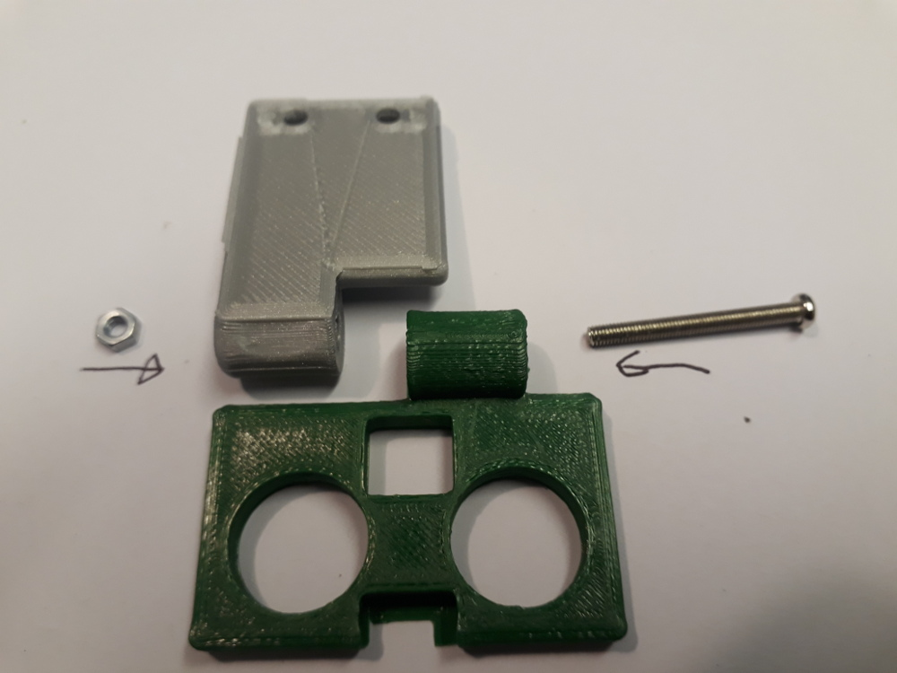

Figure 8: Building the ultrasonic sensor holder.

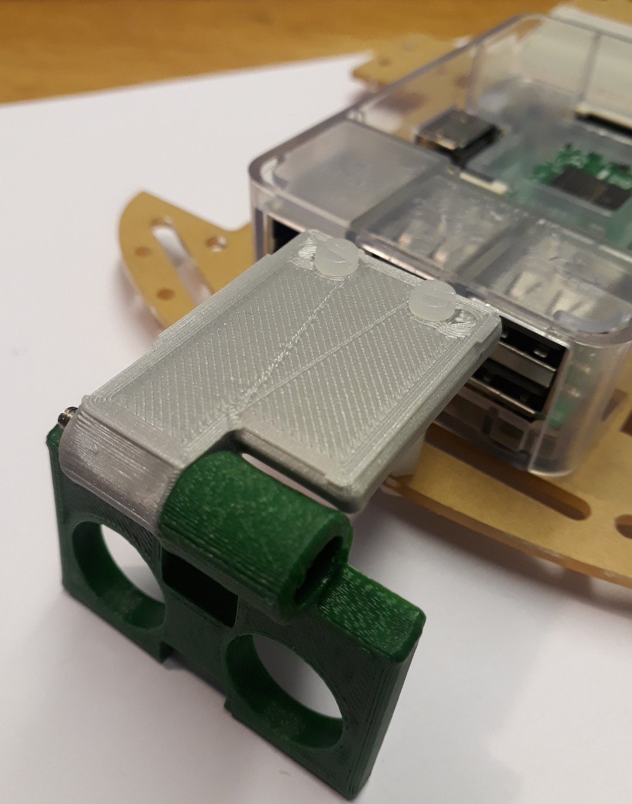

Figure 8: Attaching the ultrasonic sensor to the buggy, with two long plastic screws.

**Step 7:** Find the PI camera and it's 3D printed holder in your tool box, also find two short M3 metal bolts, and two M3 nuts.  Build the camera holder as shown in figure 9, and then attach it to the buggy as shown in figure 10.  Do note that the ribbon cable attached to the camera is very delicate, if you bend it so there is a kink in it, then it will break all the connections within the cable.  It is the same type of cable as used in mobile phones, treat it with care.

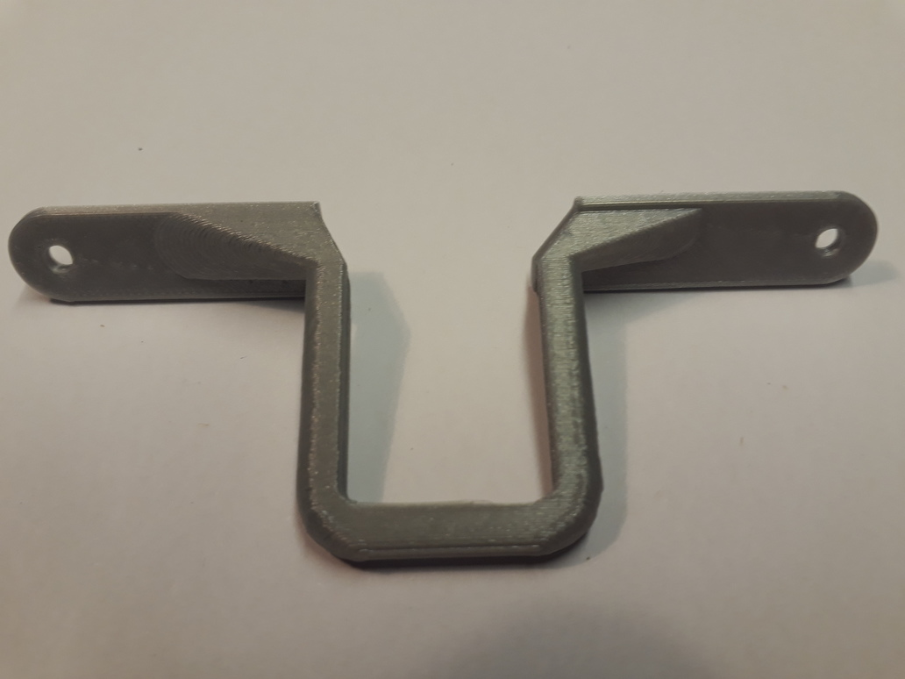

Figure 9: Building camera holder.

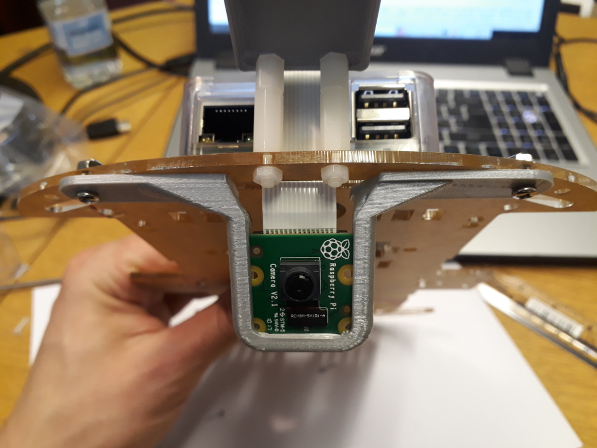

Figure 10: Attaching the camera holder to the buggy.

Section 2: Constructing the bottom of the buggy
-----------------------------------------------
**Step 1:** The main components of the buggy are two large plastic plates, so far you have used one plate to build the top of the buggy. Now, go and find the second one of these plates, this time it does not have any bread board attached to it.  This is shown in figure 11.

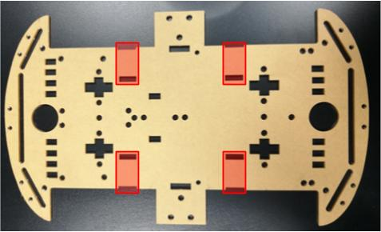

Figure 11: The bottom plate of the buggy

**Step 2:** Now go and find the gear boxes for the buggy,  they are bright yellow and look what is shown in figure 12.  From one pair there should be two with wires coming out of them, and the other pair should not have any wires.  At each corner of the base plate, there are slots to attach each of the four gear boxes, as highlighted in red in figure 11. Using two of the t-shaped plastic pieces shown in figure 12, the mount the motor to the bottom of the base plate by placing one on each side.  Also look at figure 13 to show you how the finished item should look.  Note, in figure 13 the two gear boxes with wires are mounted together, and the ones with no wires are mounted together.   You should do the same.

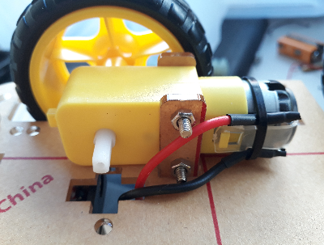

Figure 12: The gear boxes of the buggy, this one has a motor attached to it.

**Step 3:** As shown in figure 12, the motor case should be attached to the base plate by threading one of the motor mounts through the board and placing the other in the groove on the outer edge of the plate. The bolts in the kit can then be threaded through the motor mounts and motor casing to hold the motor in place. Once the bolts are in place, the nuts should be used to securely fasten the motor casing in place on the base.  Note, the nuts must go on the inside of the buggy, and the screw heads on the outside, or the bots will stick into the wheels.

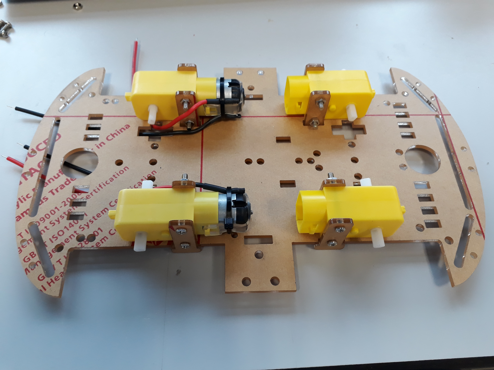

Figure 13: The gear boxes and motors attached to the buggy.

**Step 4:** This process can be repeated with all of the motor mounts in all four corners of the base plate. Ensure that the motor casings containing the motors are both attached to the same end of the base. Once all motors are attached, thread the motor wires through the opposite side of the base plate as shown in figure 12.  Finally push the wheels onto the shafts coming out of the gear boxes.

**Step 5:** The threaded posts can now be attached to each corner of the base plate. The posts can be placed in all four corners of the base plate as shown in figure 14, and then secured in place with nuts as shown in figure 15.

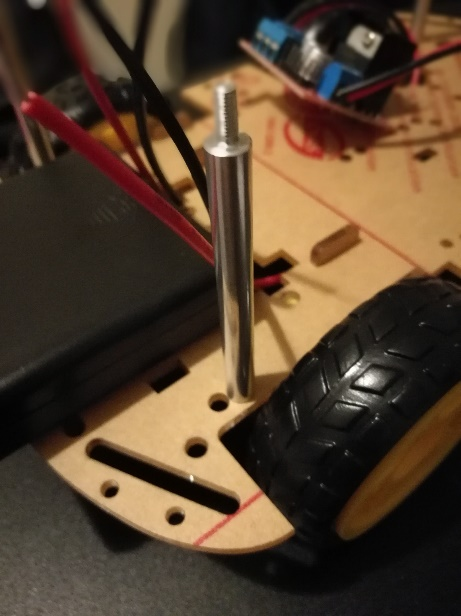

Figure 14: Threaded post attached to the base plate using a nut on the underside of the plate

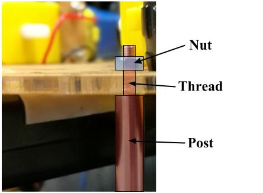

Figure 15: The posts are attached by placing the threaded end through the hole in the corner of the plates and securing with a nut.

Section 3: Wiring the motors
----------------------------
**Step 3.1:**  The raspberry PI can not deliver enough current to drive things which require a large amount of current such as a motor.  We therefore need some form of current amplifier which will amplify the small signals coming from the PI to larger current signals which can drive the motor.  To do this we will use a motor driver board, the one we are using is an L289N, take the motor driver from your tool box, and the cable shown in figure 16.  Figure 16 shows the process of fitting the control cable to the motor driver board.  If your motor driver is new, you will have to remove the two little [jumpers](https://en.wikipedia.org/wiki/Jumper_(computing)) from the board before fitting the cable.  These jumpers are needed for a different type of motor.  Notice that there is a right way and a wrong way to fit the cable, the metallic bits on the cable should be facing away from you.

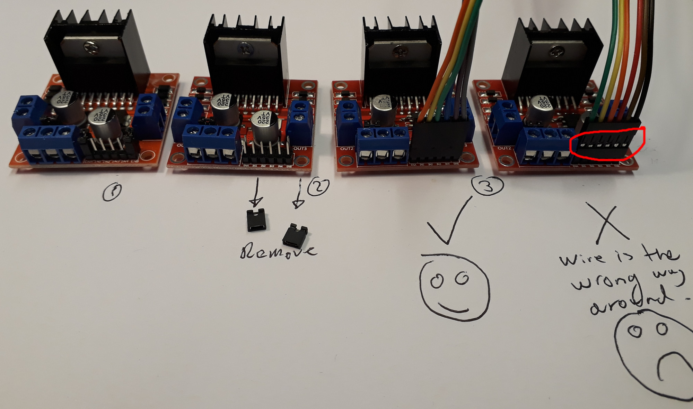

Figure 3.1: Fitting the control cable to the motor driver board, note there is a wrong way and a right way to fit the cable. The metal tabs on the cable should be facing away from you, and towards the board.

**Step 3.2:**  Now ask a demonstrator for a power supply module to the buggy.  These consist of four components, and on-off switch, a battery holder, and a USB power converter, they are all joined together in a 3D printed enclosure.  The buggy requires two different voltages to run, a 5V supply which powers the PI, and a 12V supply which drives the motors.  Having a very steady 5V supply is essential to for the PI to run smoothly, the motors can tolerate a voltage between about +15V and +10V.  The red and black wires coming out of the battery pack provide the motors with 10V-15V.  Connect the red and the black wires to the motor controller board as shown in figure 17 .  The red wire should go in the far left hole, and the black wire in the middle hole.  If you put them in the wrong holes, you make see SMOKE!!!  IF IN DOUBT ASK FOR HELP!! You will have to use the screwdriver to clamp the wires in place.

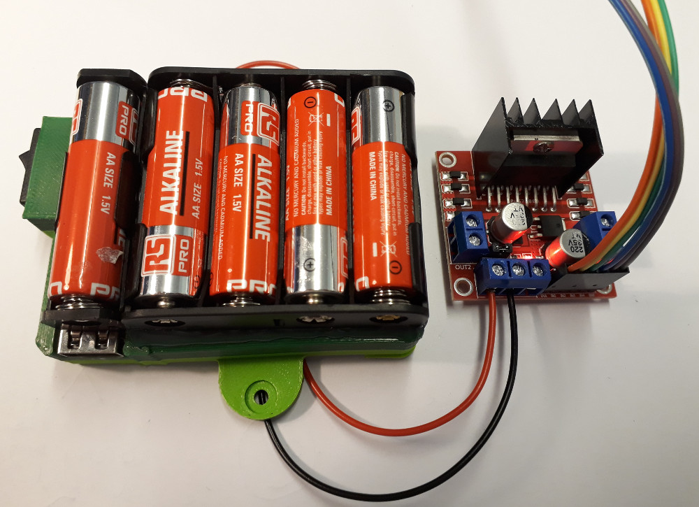

Figure 3.2: Attaching the power supply to the motor driver board.

**Step 3.3:** Fill the battery holder with batteries.  You will be able to get batteries from a demonstrator.  We have a lot of left over batteries from last year, I would like to use these up first before opening new boxes of batteries (for environmental reasons).  Use the a voltmeter to test the voltage of second hand batteries, if the voltage is below 1.1V, then they are probably flat.  Put these into the battery recycling bin, and find some more with a higher voltage.  Once you have populated your power supply with batteries flick the switch on the power supply and you should get a red light as shown in figure 3.2.  Now turn the power supply back off.

**Step 3.4:** Once you have wired up the motor driver board, find in your toolbox:
* Two short plastic hex standoffs.
* Two plastic nuts.
* Two plastic screws.
Then use them to attach the motor driver board to the bottom of the buggy as shown in figure 3.3

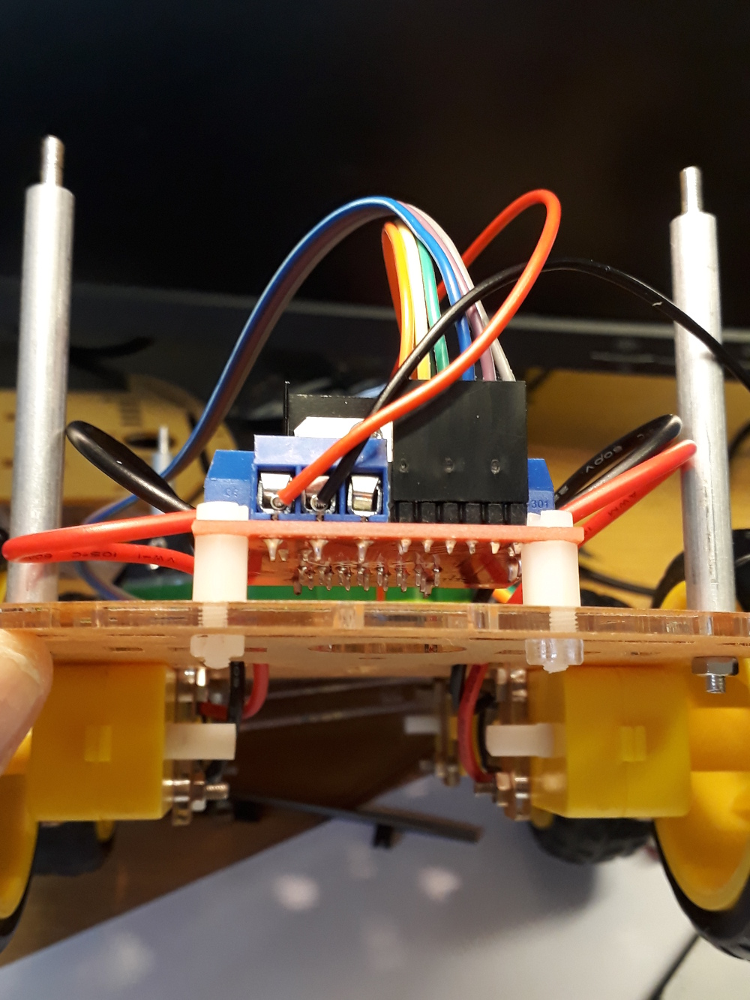

Figure 3.3: Attaching motor controller board to the buggy.

Section 4: Joining top and bottom of the buggy
----------------------------------------------
**Step 4.1:** Now place the top of the buggy on the bottom of the buggy as shown in figure 4.1.

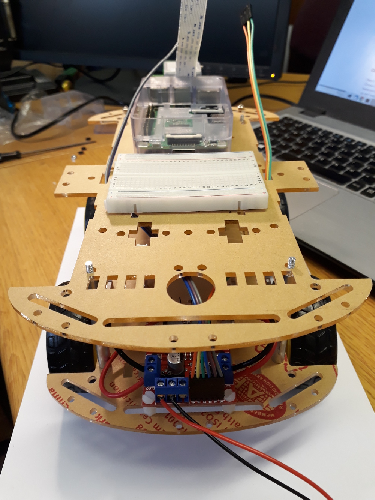

Figure 4.1: Joining the top and bottom of the buggy.

**Step 4.2:** Once you have placed the top of the buggy on the bottom, place the battery holder on top of it, then use four metal nuts to secure it, as shown in figure 4.2.

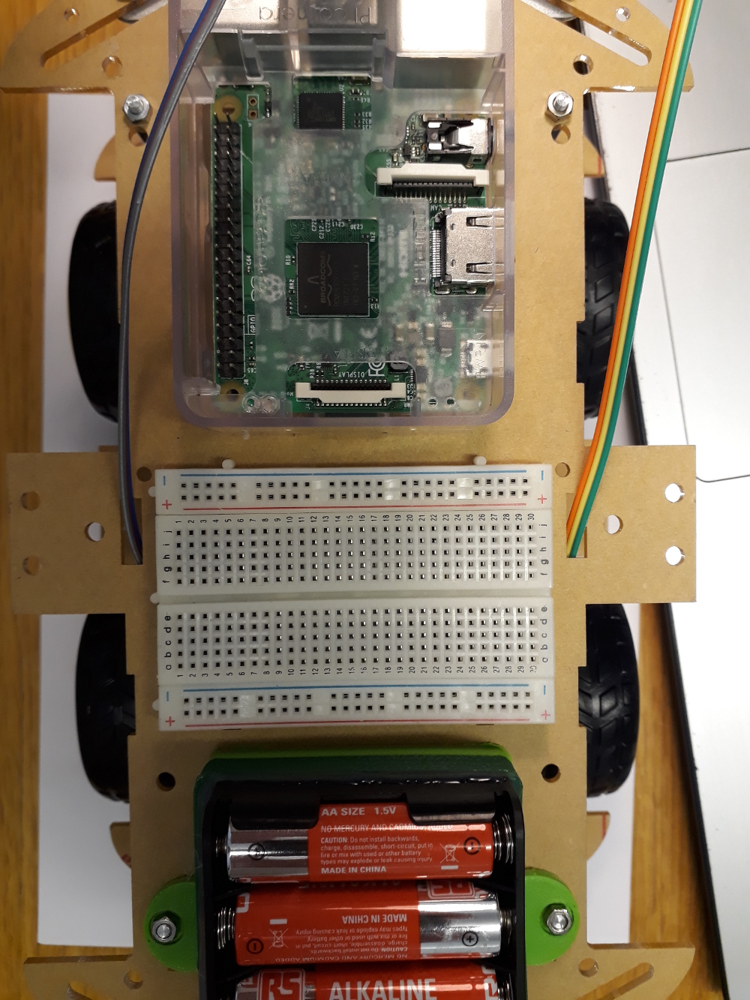

Figure 4.2: Securing the top to the bottom of the buggy.

**Step 4.3:** Now connect the control wires to the PI, from the motor board.  Figure 4.3, shows you how to do this.  Be very careful to connect the wires the correct way around and onto the correct pins.  If you get it wrong you may damage your PI.  To figure out the correct way around they should go, you will have to look at the wires going into the motor driver board and compare them to the the wiring diagram.

Figure 4.3: Connecting the motor wires

Section 5: Joining up the camera
--------------------------------
**Step 5.1:** It is now time to attach the camera to the PI.  The camera is connect to the PI using a very delicate ribbon cable.  If you kink this cable (i.e. bend it by more than about 50 degrees it) it will break the internal wires.  There is a white socket on your PI, as shown in figure 5.1.  With your screwdriver or your nails very gently loosen the white plastic clip until it is loose.  Then slip the cable into the socket as shown (it's a bit fiddly so be patient and don't bend the cable - if you need demonstrator help ask for it..).  There are two sides to the connector, one side with the metal contacts and one side with a plastic covering.  The cable must be inserted in the orientation shown in the figure or the camera will not work.

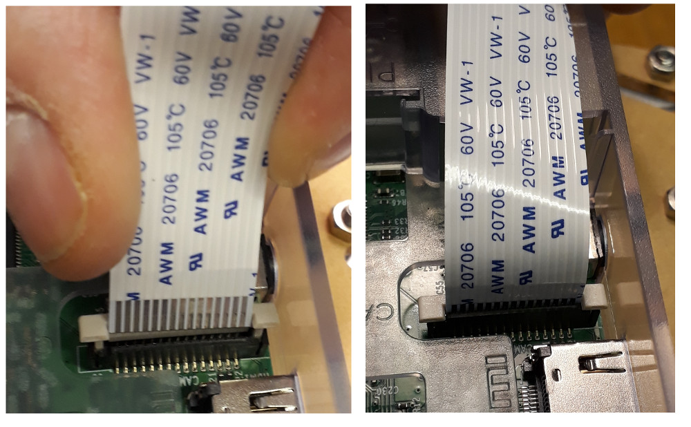

Figure 5.1:  Attaching the camera to the PI.

Section 6: Attaching the ultrasonic sensor
------------------------------------------
**Step 6.1:** Now find the ultrasonic sensor and the driver board to the sensor in you tool box, these items are depicted in figure 6.1.  Also go and find in the box of wires:
* Two female-female jumper wires.
* Two female-male jumper wires.
Attach the female-male jumpers leads to the sensor driver board, on the far left and far right hand pins.  And attach the female-female wires to the two inside pins.

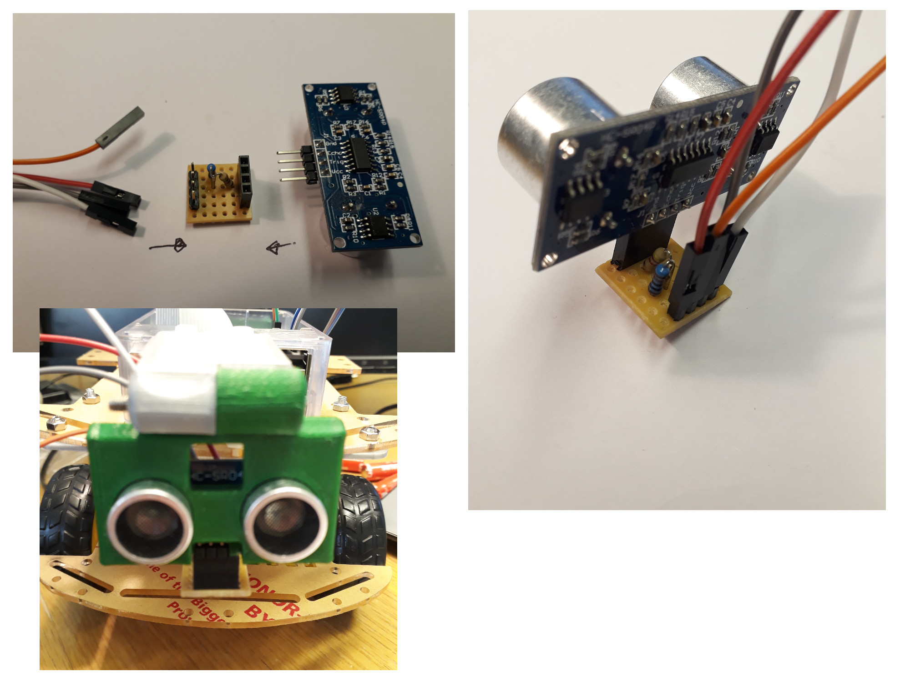

Figure 6.1:  Building the ultrasonic sensor, and attaching the wires.  The female-male jumpers leads should be on the far left and right pins, while the female-female wires should attach to the two inside pins.  It does not matter which color wires you use, in the next steps we will connect this sensor to the PI.

**Step 6.2:**  We will power the PI using it's micro USB port, the power will come from the batteries via a voltage converter which will step down the 10-15V supply from the batteries to a steady 5 Volts.  If you look at figure 6.2, you can see a diagram of the output pins on the PI.  Click on the picture to zoom in.  The section of the diagram labeled GPIO Pin out tells you what each of the pins does on the PI, some pins can be used to control things, some pins can be used to read information in from sensors.  Pin 4 and 6 expose the +5V and 0V from the power supply to the PI, we are going to tap into these pins to get the voltage we need to drive the ultrasonic sensor (and later other components).  Get two female-male wires, and connect them to pin 4 and 6, as shown in figure 6.2.  Then connect the wires to the bread board as shown in the diagram.  The wire coming from pin 4 should go to the red strip on the bread board, and the wire coming out of pin 6 should go to the blue or black strip on your bread board.

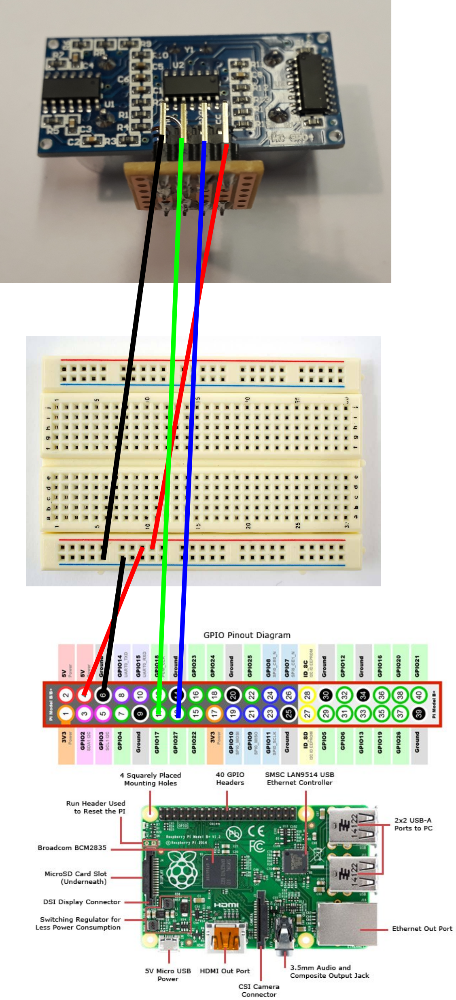

Figure 6.2:  Wiring the ultrasonic sensor to the PI.

> **What is breadboard?**

> Breadboards allow you to quickly and easily build electronic circuits without the need to solder wires together.  By placing wires and components into the holes in the board you can build a circuit within minuets. Each hole in the breadboard is electrically connected to all the other holes in it's row, as shown by the red lines in figure 6.3.  In the bread boards we use, the connections run down the board on the far right and left of the board, and across the board for all other pins.

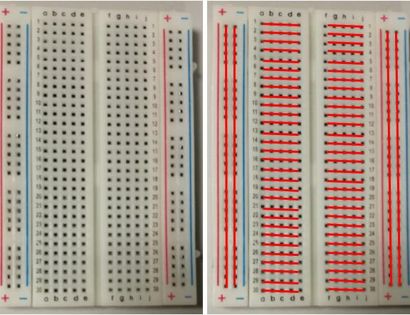

>Figure 6.3:  Layout of the breadboard, with the image on the left showing the common connections between pins.

After having completed this step, the black strip on the bread board have 0V on it and the red strip will have +5V on it.  Now connect the ultrasonic sensor to the breadboard as shown in figure 6.3, the sensor will now be able to get it's power from the bread board.

**Step 6.3:** Now, connect the final two wires from the ultrasonic sensor to the PI as shown in figur 6.2.  One of these wires tells the ultrasonic sensor to produce a sound (or a ping) which will reflect of an object, and the other wire tells our PI when the signal has reached the sensor again.  My timing the time taken between sending out a ping and hearing it after it has reflected off an object, the PI can figure out how far away it is.

Section 7: Powering on the buggy
--------------------------------
**Step 7.1:** Find a demonstrator and ask them to check your buggy. ;)

**Step 7.2:** Find the small black USB cable, and connect it between the battery pack and the PI.  Then place the buggy on the floor and turn it on.  It will take a while to boot then it will start to move forward.

>Actually it probably won't move forward it will either spin or go backwards.  The red and black motors wires are connected randomly to the positive and negative terminals on the motors.  To make it go forward you will have to turn the buggy off again, unscrew the wires connecting the motors to the motor driver board, then swap then and boot the buggy again.

Section 8: Exploring the PI
---------------------------

**Step 8.1:** If your buggy is switched on, now switch it off.  Connect the PI up to the PC monitor using the HDMI cable which you will find in the buggy kit.  Also, carefully, disconnect keyboard and mouse from the PC from the computers and reconnect them to your PI.  Now disconnect the black wire connecting the battery pack to the PI, and reconnect the PI to a USB port of a computer.  For this exercise we will power the PI from a USB port of the computer to save batteries, when ever possible try to do this as it saves the environment a bit, the only draw back of doing this is that the motors will not run as they need 10-15V which can only be supplied by the batteries.  Be very careful not to power the PI off the computer and batteries at the same time, as you could damage the computer.

>**Question 1.1:** Why do you think we are not using reusable batteries for this lab?  Think about battery life time and how they are used over the year.  Discuss this with your group, and make a note of the answer. *Save the answer to this in worksheet_1.m*

**Step 8.2**:  If you followed the instructions in step 8.1, you should have a desktop which looks like figure 8.1.  The PI runs Linux which is a bit like windows but usually used on phones, tablets and servers.  There is a lot of software available for the PI (possibly more than there is for windows), but I have chosen to do a minimal install to save disk space.  Never the less, there is a word processor installed, Octave a version of MATLAB which is free and Minecraft(!!).  Try to find these packages in the start menu and have a play with them.

**Step 8.3**:  Once you are finished playing write the answer down to question 1 down in the word processor, and save it to the Desktop of the PI - we will use this later.

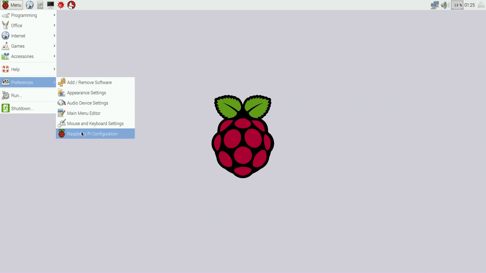

>Figure 8.1:  An example of the PI desktop.

Section 9: Starting your robot buggy report
-------------------------------------------
The buggy building activity will be examined though both a short report and through the code you write during the activity.  All your code should be submitted in a zip file as usual, and your report should be placed in the zip file as a pdf.  Your report should contain:
* A cover page, with your name, e-mail address and student ID.
* One section for each worksheet you do.
* Each section should contain the answers to each question posed during the work sheets.
* Each diagram/figure should have a figure number and a caption.

For today's session, your report should include the answer to question 1.1 along with the answers to the following questions:

Take a picture of your group with the completed buggy (you can't take the photo if you are doing the virtual lab), save this ready to be uploaded in the zip file.  Then answer the following questions in as few words as possible (I'm thinking closer to 10 words rather than  100), *save the answers as comments in the file worksheet_1.m*:

>**Question 1.2:**  Describe in as few words as possible why we use a motor driver board.

>**Question 1.3:**  Why do we use two voltages to drive the motors and the PI?

>**Question 1.4:**  Use the internet to find out why it is critical to have a steady supply voltage to drive the PI.

>**Question 1.5:**  What do the letters ARM stand for in relation to the PI?

>**Question 1.6:**  Use the internet to find out how much RAM the PI has, and how fast it's CPU in Hz compared to an older Pentium 100 desktop PC?

>**Question 1.7:**  What do the letters GPIO stand for, and what are the GPIO pins used for on the PI?

>**Question 1.8:**  What sensors does the robot have to detect the external world? 

>**Question 1.9:**  Name five languages you can program the PI in.

>**Question 2.0:**  Please make sure you have done the preparation work "Self study prep material - lecture 1"/"Self study prep material - lecture 2". Please upload the answers with this lab.  If you do not attempt the preparation material you will not be able to get any marks for the buggy session.  The aim of these work sheets is to reinforce the basic MATALB material we have covered in lectures 1-10 and to introduce the concept of classes. 

Preparation work
----------

Navigation
-----------------
[<<Worksheet 0](https://github.com/roderickmackenzie/matlab_robot_buggy/blob/master/WS0/worksheet.md) |
[Worksheet 2>>](https://github.com/roderickmackenzie/matlab_robot_buggy/blob/master/WS2/worksheet.md)
