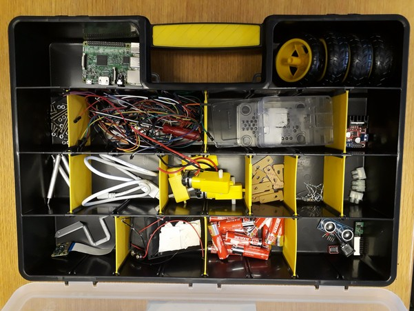
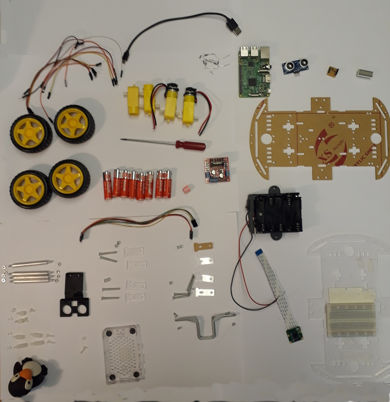
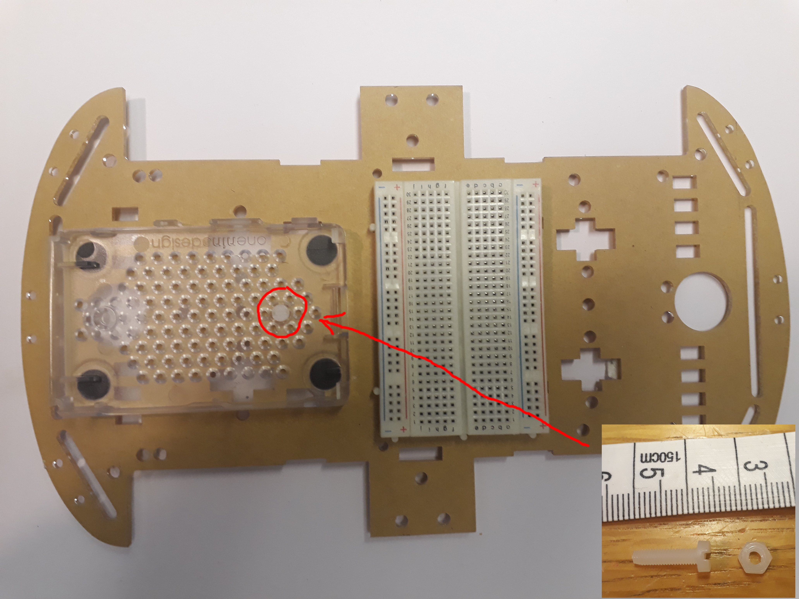
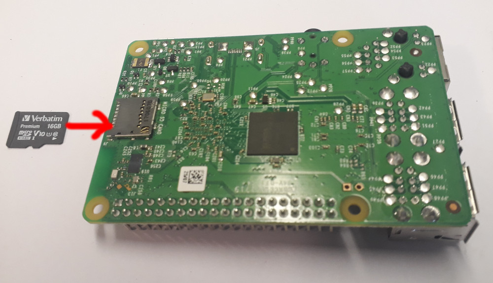
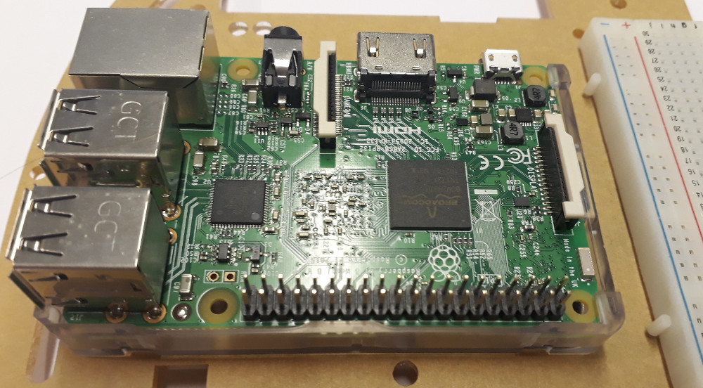
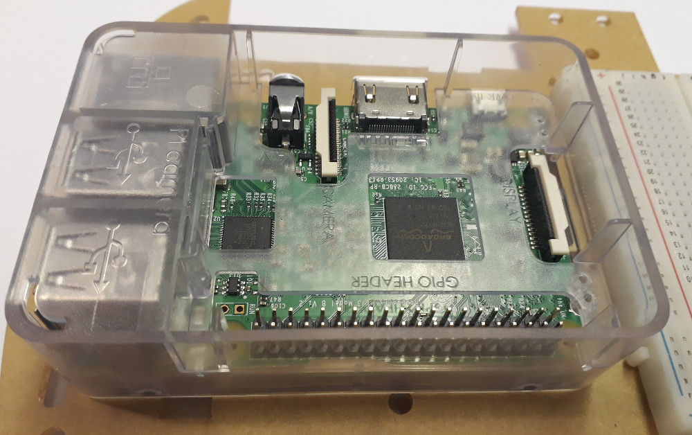
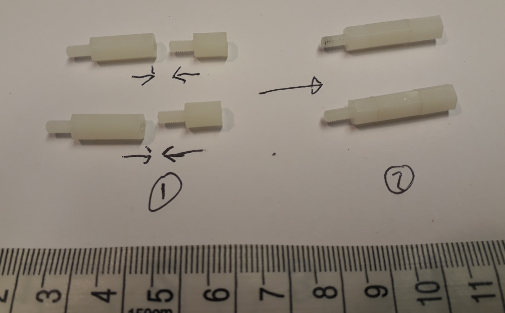
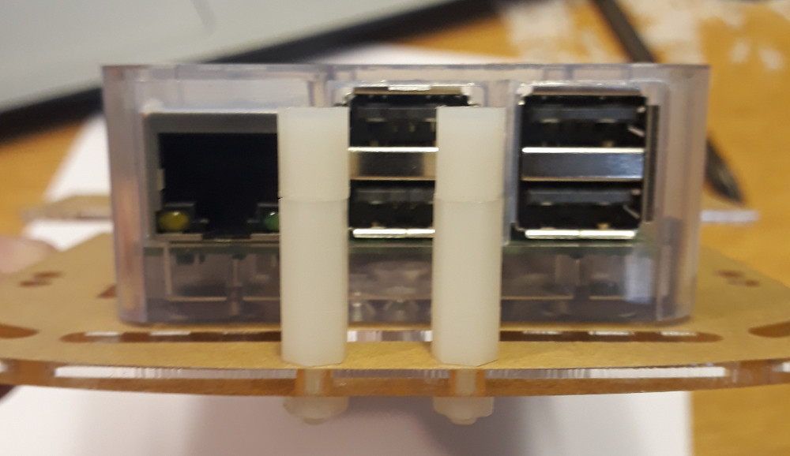

Worksheet 1
===========
Introduction
----------
This series of four labs will take you through the process of building a computer controlled robot buggy.  In essence there are two parts to the buggy.  The mechanical buggy with it’s motors, gear boxes and wheels, and the electronic system which controls the buggy.  Our buggies will be controlled by a Raspberry PI computer.  This is a fully fledged computer on a single board, it uses the same type of powerful [microprocessors](https://en.wikipedia.org/wiki/ARM_architecture) which are in your mobile phone.  It has screen output, USB ports, Network ports, WiFi and everything you would expect from a normal desktop computer.  It is my hope that by introducing you to this computer early on in your degree, you will be able to use it in your projects later, or indeed use it in your own projects at home.  First we are going to configure the Raspberry PI computer, then we are going to build the buggy.

Your robot buggy kit
-----------------
The robot buggy kit is sown in figures 1 and 2.  Figure 1, shows how the components should be stored in the toolbox, and figure 2 includes the larger components which will not fit in the box.  When you return your buggy at the end of the buggy building sessions, all the components should be placed into the toolbox exactly as you found them.

Figure 1: The robot buggy kit in it's toolbox, when you return your buggy kit, it should be set out in exactly the same way as you got it.

Figure 2: The robot buggy kit spread out on a table, including larger components which will not fit in the box.

Your box should contain:
|  Item              |  Number  	| Provider  |  Order code |
| ------------------ | -------- 	| --------  | -------- |
|  Wheels            |  x4      	| Amazon |  |
|  Screwdriver       |  x1      	| RS |  |
|  Posts 			 |  x4      	| RS |  |
|  Yellow motors 	 |  x4      	| Amazon |  |
|  Black USB wire 	 |  x1      	| Amazon |  |
|  Pre-made motor wire |  x1    	| UoN |  |
|  Raspberry PI |  x1           	| RS |  |
|  Acoustic sensor   |  x1      	| Amazon |  |
|  Wires             |  lots    	| Amazon |  |
|  Acoustic sensor holder | x1  	| UoN |  |
|  L298 motor driver board | x1  	| Amazon |  |
|  Red dipswitches | x1  			| RS |  |
|  LED bar graph | x1  				| RS |  |
|  Acoustic sensor interface | x1  	| UoN |  |
|  Camera holder | x1  				| UoN |  |
|  Camera+ribbon cable | x1 		| RS |  |
|  Raspberry PI enclosure | x1		| RS |  |

It should also contain the following number of bolts and nuts:

|  Item              |  Number  	|  	Provider  |  Order code |
| ------------------ | -------- 	|   --------  | -------- |
|  Motor supports screws   |  x8    |  |  |
|  Long metal screws |  x8       	|  |  |
|  Plastic screws M3 short  |  x2   |  |  |
|  Plastic screws M3 long  |  x3    | RS | 527-987 |
|  M3 plastic nuts       |  x5      |  |  |
|  M3 nuts           |  x18      	|  |  |
|  Plastic hex supports long  |  x2 | Rapid | 33-2044 |
|  Plastic hex supports short |  x4 |  |  |
|  M4 nuts 					  |  x1 | RS | 525-896 |
|  M4 bolts 					  |  x1 | RS | 278-708 |

Getting to grips with the Raspberry Pi
--------------------------------------

**Step 1**: Locate:
* The top plate to the buggy, this is a brown piece of acrylic with a white thing stuck to it (this white thing is called a bread board).
* The case for the raspberry PI, this is clear acrylic box, which comes in 2/3 parts
* A long *PLASTIC* screw and a *PLASTIC* washer.

These components are shown in figure 3.   If you do not have any of these components go and ask a demonstrator for them.  *Do not use a metal screw this will short the PI and destroy it.*

Figure 3: The top bottom half of the PI case, fixed to the top of the buggy.

Hold the top plate to the buggy in your hands, and notice that the breadboard is slightly offset from the center of the board, arrange the bottom of the PI case and the top of the buggy so that it looks like Figure 3.  Then take the long screw and pass it though one of the large holes in the PI case, until it pokes out the other side.  Then pass the screw though a hole in the top plate to the buggy and fasten it in place with the nut.  The result should look like Figure 3, if something does not fit, don't force it ask a demonstrator for help.

**Step 2:** Locate the [raspberry PI](https://en.wikipedia.org/wiki/Raspberry_Pi) in your toolbox.  When handling the raspberry pi, it is important to note that you are directly handling the circuit board of a computer.  Circuit boards are very delicate, and can be damaged by moisture form your hands and static electricity from your body.  It is also important to note that all the metallic bits on the back of the board will have electricity running through them, (so I would not recommend licking them!), so it is important you don't place the raspberry PI on any metallic objects such as metal pens, rulers, coins etc... Locate the SD card in your kit (the demonstrators may will have these), and insert the SD card into the PI as shown in figure 4.  The SD card acts as the internal hard disk for the PI, it contains both the operating system ([Raspbian which is a version of Linux](https://www.raspberrypi.org/downloads/raspbian/)), and acts a place to store your work.

Figure 4: Inserting the SD card into the PI.

**Step 3:** Insert the PI into the base of the case. See figure 5.  Note there is a little slot for the SD card to poke out of on the right of the case.  If it does not fit, don't force it ask for help.

Figure 5: The PI inserted into the case.

**Step 4:** Find the top of the PI case and clip it on over the rest of the PI.  This plastic case protects most of the circuit board but leaves the IO (Input/Output) pins exposed.  This is shown in figure 6.

**Step 5:** Find the two short hex spacers, and two long hex spacers, as shown in figure 6.  Screw these together and insert them into the front of the buggy as shown in figure 7, fasten the hex spacers in place with two plastic nuts.

Figure 6: Building the legs for the ultrasonic sensor. 

Figure 7: Attaching the legs for the ultrasonic sensor to the buggy, using two **plastic** nuts.

Step 6: Now on the computer next to the one which is writing the image to the SD card (i.e. using another computer).  Connect the PI up to the PC monitor using the HDMI cable which you will find in the buggy kit.  Also, carefully, disconnect keyboard and mouse from the PC and reconnect them to your PI. Now, insert the SD card into your PI.  Your PI is now set up and ready to go.  All new need now is power!  We will get this from the USB port of the computer.  In your buggy kit, you should see a white, USB cable, with a micro USB end, this looks like a phone charging cable.  Connect one end to a PC, and the other end to the PI.  We are using the computer as a power supply, at the moment.  Later on we will power the PI off batteries.  Be very careful not to power the PI off the computer and batteries at the same time, as you could damage the computer.  I also suggest, you try to power the PI off the computer as much as you can, so you don’t drain your batteries.

Step 7: Once the power is connected, the PI should begin to boot up. After a minute or so, you should be able to see the desktop of the raspberry pi and be able to interact with its installed programs as shown in figure 3. If this doesn’t happen, ensure the SD card is correctly inserted, and ask for help!
Step 8: Have a  quick play with the PI’s desktop and start a few programs.  You can see that it is really a fully functioning computer.  Try to find the word processor (hint: It’s called Libreoffice)

Building the buggy
----------
Now that we have the PI working, let’s build the buggy.
Step 1: The main components of the buggy are two large plastic plates.  Go and find these in the buggy kit (see figure 5).  Choose one of the plates to be the base to your buggy, and one to the be the top.

Step 2: Now go and find the gear boxes for the buggy, they are bright yellow and look what is shown in figure 6, there should be two with wires coming out of them, and two without any wires.  The gear boxes with wires have motors, the gear boxes without wires don’t have any motors.  At each corner of the base plate, there are slots to attach each of the four gear boxes, as highlighted in red in figure 5. Using two of the t-shaped plastic pieces shown in figure 6, the mount the motor to the bottom of the base plate by placing one on each side.  Also look at figure 7 to show you how the finished product should look.  Note, in figure 6 the two gear boxes with wires are mounted together, and the ones with no wires are mounted together.   You should do the same.

 

Step 3: As shown in figure 6, the motor case can be attached to the base plate by threading one of the motor mounts through the board and placing the other in the groove on the outer edge of the plate. The bolts in the kit can then be threaded through the motor mounts and motor casing to hold the motor in place.
Step 4: Once the bolts are in place, the nuts can be used to securely fasten the motor casing in place on the base.  Note, the nuts must go on the inside of the buggy, and the screw heads on the outside, or the bots will stick into the wheels.

Step 5: This process can be repeated with all of the motor mounts in all four corners of the base plate. Ensure that the motor casings containing the motors are both attached to the same end of the base. Once all motors are attached, thread the motor wires through the opposite side of the base plate as shown in figure 6. 

Step 6: All the wheels can now be attached to the motor casings and the base flipped over. This forms the base of the buggy and the starting point of the design.  The wheels should just push fit on.
Step 7: In your box you will have two power battery packs, one which can take four AA cells and one which can take five AA cells, we are going to join them together, so they can produce about 12V, enough to power the buggies motors.  Using a few bits of sticky pad (you will have to layer them to make them high enough to stick), join the two packs together (back to back), as shown in figure 8.

Step 8: You should, have a battery clip in your box (it’s the sort of clip you would expect to attach to a 9V battery), attach two single junction boxes to it as shown in the figure 9.  The junction boxes come in strips of 10, to get a single one, just twist or cut one off the strip.  You may also have to use the wire cutters to remove a bit of wire so the wires can be easily screwed in to make a good contact.

Step 9: The black wire coming out of the x4 AA battery pack is a bit too long, cut it to around 7cm (if it has not already been cut).  Once this is done, connect it to the red wire with from the battery clip, using the junction box.  Then, clip the battery clip onto the x5 AA cell battery pack.  This is all shown in figure 10.

Step 10: The battery pack should, now have two wires coming out of it, a black one with a junction box on it and a red one with no junction box on it.  Find another single junction box and attach it to the battery pack, so both wires coming out for the battery pack have junction boxes on them.  Then get a single jumper lead, with two male ends on it.  Cut it in half, strip the ends and screw them into the junction boxes attached to the battery pack.  The final battery pack, assembly should look as shown in figure 11.

Step 11: You should have a big pack of AA batteries in your kit, find 8 of them, and fill up the x5 battery holder with them, and x3 slots in the x4 battery holder.  As shown in figure 12.  NOTE: WE ARE INTENTIONAL NOT FILLING THE x4 BATTERY HOLDER FULLY, AS WE DO NOT YET WANT TO POWER THE BUGGY.  ONCE YOU HAVE WIRED UP THE BUGGY, GET A DEMONSTRATOR TO CHECK THE WIRING.  THEN PUT IN THE FINAL BATTERY. :)

 Once you have done this, use some more stick pads to attach the battery holder to the buggy, over the axils with the motors as shown in figure 13.  Ensure the battery pack is placed on the end above the motors to put the weight of the buggy over the powered wheels.

Step 12: Although the majority of the wiring will be addressed in the next section, the motor wires will be attached now. Go and find the motor driver board from the buggy kit.  It is the circuit board shown in figure 14.  The motor wires are attached to the motor driver board at the positions shown in the figure.  Use the screwdriver to loosen the terminals, place the wires in the terminals and then tighten the screws up clamping the wires in place.  Make sure they are in tightly.

Step 13: Once you have wired up the wires carrying current to the motors, you then need to add the wires carrying power to the circuit board from the battery.  Choose two wires with two male ends and add them screw them into the circuit board as show in figure 15. I’ve used brown and black wires, but you can use any color wires you want.

Step 14: Finally, find six female to female, jumper leads and attach them to the front most pins on the motor driver board, shown in figure 16.  It does not matter what color they are.  There may be some jumpers on some of the pins, if there are, just remove them.  The final wired up jumper board should look like figure 16.  The three wires on the left are to control the left hand motor and the three wires on the right are to control the right hand motor.  These are called the motor control wires.

Step 15: The threaded posts can now be attached to each corner of the base plate. The posts can be placed in all four corners of the base plate as shown in figure 9, and then secured in place with nuts as shown in figure 18.

Step 16: Once all posts have been securely attached to the base plate, the upper plate can be placed on top of the posts and secured with additional nuts. As the plates are not symmetrical, the plate may need rotating until it can fit properly.   Thread the wires from the battery from below up through the top plate as shown in figure 19.

Step 17:  In step 14 you attached six female-female jumper cables to the motor control board.  Take the left hand set of three wires and thread them through the top plate, then take the right hand set of three wires and thread them through the top plate.  This is shown in figure 20.

Step 18: With the top plate in position, attach the remaining components (raspberry pi, breadboard) using the double-sided sticky pads. The components must be attached in the orientation shown in figure 21. Note: Only use a 1cm2 of sticky material, or it will be very hard to dissemble the buggy later on.

Wiring the buggy
----------
Congratulations you have now built your buggy!!  With all the components in position, they can now all be wired up in order for the buggy to work. Due to the complexity of the wiring, each section will be addressed individually in order to reduce the complexity of the process.  The buggy won’t work until all parts are wired up.
Step 1: In this section, you will be wiring up each system of the buggy individually according to a series of wiring diagrams. Most of the wiring will be based on using an electronic breadboard as shown in figure 18. Breadboards allow you to quickly and easily build circuits by placing wires and components into the holes in the board. Each hole in the breadboard is also electrically connected to a series of other holes (as shown by the red lines in figure 12).

 
Step 2: The first system to be wired is the power supply for both the motors and the PI. In order to connect all the components, you will need jumper cables, (it does not matter which color jumper cables you use), a voltage regulator, switch and a battery connector. An image of the voltage regulator is shown in figure 23.  The voltage regulator takes the voltage supplied by the battery (which can vary depending on how used the batteries are but should be around 12V), and ensures it’s a nice steady 5V for the PI to use.  Now go and find these components in the buggy kit.

Step 3: Once you have the correct components. First mount the voltage regulator on the board as shown in figure 24.  Make sure it is the right way around, and in exactly the same position as shown in the figure. Then connect the wires as shown in figure 25, using the jumper cables.

>>Note: You must ensure you connect the jumper cable to the correct pin on the raspberry pi in order for this to work

      

Step 4: Once the power supply to batteries and PI have been connected, you can now connect the output pins that will control the motors. Using the female-to-female jumper cables which you have already threaded through the top plate of the buggy, connect the raspberry pins to the motor controller board according to the diagram in figure 27. Again, ensure you attach the correct pins, otherwise the motors will not respond to commands.
 

Step 5: You will now connect the echo distance sensor to the raspberry pi. The echo sensor has four pins: 5V power, ground, trigger and echo. The sensor works by sending an ultra-sonic pulse, and then recording the time it takes to detect an echo. Using this time and the speed of sound, the distance to the nearest object in front of the sensor can be determined. As with the motor controller, you can connect the echo sensor the raspberry pi using the jumper cables. However, you must use two resistors (R1 and R2) in order to correctly use the sensor.

Step 6: In order to correctly connect the echo sensor, you must first place two resistors, R1 and R2, with resistances of 4.7 kΩ [color code yellow, purple red, gold] and 10 kΩ [brown ,red, black, black, brown] respectively. The resistors are to be placed onto the breadboard in the positions shown in figure 28. You will have to trim the end of the resistor wires in order to get them to sit flush to the board, as shown in figure 25.

Step 7: Once the resistors are in place, you can connect the rest of the pins using the jumper cables according to the diagram in figure 16. Once the echo sensor is connected, you can then use blue tack to attach it the top plate battery pack as show in figure 27.  If you don’t have blue tack, it should just sit there on it’s own.

Figure 29: Image of ultrasonic sensor mounted about the battery pack.  It should just sit in the grove.

Step 8: Once all the wiring is complete, it should look like the image shown in figure 28. At this point, the wiring is complete and the top plate can be secured with nuts four M3 nuts.
Figure 30: Image of how the buggy should look once fully wired.

Step 9: Finally the camera and camera mount can be attached to the buggy. First, slide the ribbon cable of the camera through the slot in the front of the buggy (figure 31).  The camera is then connected to the raspberry pi using a ribbon cable. To connect the camera to the pi, you must lift the black clip shown in figure 31 and slide in the ribbon cable with the metal contacts facing away from the USB ports. Once the ribbon cable is in place, the black clip can be pressed down, locking the ribbon cable in.  If you struggle with this ask a demonstrator for help!!  They ribbon cable is very easy to damage.
Figure 31: Camera board ribbon cable attached to the raspberry pi

Step 10: With the pi camera connected, you can now place it inside the camera mount as is shown in figure 32. The camera mount can then be attached to the raspberry pi using the M3 bolts and nuts, as can be seen in figures 30 and 31.
Figure 32: Camera board in the mount, attached to the underside of the top plate

Testing the Buggy
Now the Buggy is complete. Ask a demonstrator to come over and check all the wiring is OK. If all is well, place the buggy on the ground and turn it on.  The image that was written to the PI contains a script that will automatically run when the raspberry pi is turned on. This stage will allow you to make sure that the buggy has been built properly, so ensure you look to make sure the motors are functioning correctly and in a straight line. If the echo sensor is working correctly, the buggy should reverse when in proximity to solid objects. 
In the case of the buggy not functioning correctly, get a demonstrator to come over and check the connections.

Marked assignment due at the end of the lab.  This is worth 20% of this series of labs:
Get a demonstrator to take a photo of your group with the completed buggy with a camera phone.  You must then each individually upload this photo to moodle into the hand in box called “Buggy: Assignment 1”.  Really this is just a nice way of checking that you were at the lab and were involved in building the buggy. Not all assignments in this lab will be that easy. ;)

Wile group work is fun, it’s also fun to do your own thing.  So for this worksheet, all parts are to be done individually, except Question 1 which you will have to do in a group. The usual plagiarism rules will apply for all but question 1. As ever, the demonstrators in the lab are here to help you.  For all questions but number 1, you can use matlab on the computers in C19/C20, you don’t need the buggy.

>This work sheet is worth 25% of the lab.

Figure 1: An example of the buggy course.

However to do this task we need sample images of the black tape, smarties and the white piece of paper.  Ask Rod (or a demonstrator ) for these objects.  Take pictures of each of the objects with the buggy camera naming them black.jpg, eggs.jpg and exit.jpg.  [Hint: I would not eat the smarties… they have spent quite a long time kicking around my office!]

**Step 4:** Insert a USB stick into the PI, and copy off the images to a USB stick.  If you  can’t work out how to do this, ask a demonstrator.  We will be using these images in the rest of the questions.

The rest of the work sheet will be individual work, not group work, done on the PCs in the computer room, on your laptop or at home.  (Usual plagiarism rules apply... sorry) When you finished the programming your code, we will copy your files back to the PI, and test them.

Question 2
----------
Start up MATLAB on your PC.  We are now going to write some simple code to do some image recognition.  The image recognition will be based on color detection.  In a new script called q1.m use the imread and imshow command to read in the image and display the image of the floor.  What do you notice about the image?  Use the manual to look up what the flipud command does.  Have a go at using it.  What does it do to the image?  Save this script as q1.m

Question 3
----------
**Step 1:** We are now going to write a function to calculate the average color of a image, and use the average color the camera sees to identify objects.  Think how placing an orange and then an apple in an image would affect the average color of the image.  If you can’t remember how functions work, revise this section in your notes.  Make a new MATLAB file and save it as *get_color.m*.  In this file we are going to make a function, copy and paste the following code, which will define a function into the file:

~~~~
function [r g b] = get_color(data)
r=1;
g=2;
b=3;
end
~~~~

Save your file *get_color.m* then from then on the command line type

~~~~
[r g b]=get_color(1)
~~~~

What values does this function return?  Change the function so that it returns r=5, g=6 and b=7. 

**Step 2:** Color images are made up of pixels, each pixel has a red, green and blue component, the values of the red, green and blue components can range form 0 to 255.  So for example, a very red pixel would be represented by the three numbers 255,0,0 or a very green pixel would be represented by the three numbers 0,255,0 and a blue pixel would be represented by the values 0,0,255.  What value would a black and gray pixel be represented by?

Have a play with this web page to understand this a bit better:
[web page](https://www.w3schools.com/colors/colors_converter.asp)  What are the RGB values of your favourite color?  Look up the RGB values for purple and save them in your script as a comment.

**Setp 3**: By looking at the color components of any image 
we can guess what could be in the image.  For example if the image is of the floor in the L3 lab, it will consist of lots of gray pixels.  If the image is full of colorful Easter eggs, it will have a wide range of colors etc...

In the next part of the example sheet we are going to edit the the function *get_color(x)* return the average intensity of red, green and blue pixels in our image.  By following the steps you will be able to do this.

Question 4
----------
**step 1:** Rather than calling your get_color(x) function from the command line, make a new script called  *detect.m*, and in that script call you function by adding the line of code:
~~~~
get_color(1)
~~~~

**step 2**: Currently we are passing the get_color function the value of 1,  we don't want to do this we would like to pass it an image from the camera.  So using imread in the script *detect.m*, read the image *floor.jpb* into a variable *a* and pass it to your function by using the code

~~~~
get_color(a)
~~~~

Now in your *get_color()* function use the command *imshow*, so that the function will display any image which is passed to it.

**Step 3:** We now need to define two nested loops to iterate over every pixel in our image.  For now we are going to pretend our image is 100x100 pixels big.  Inside the function *get_color*, underneath your *imshow* command define two nested for loops, one which counts using the variable x from 1 to 100 and one which counts using the variable y from 1 to 100.  If you can't remember what a nested loop is refer to your notes.

**step 4**:  Using the *sprintf* and the *disp* commands print out all the values of *x* and *y*, over which the loops count.

**step 5**:  We know that this image is bigger than 100x100 pixels.  Use the *size* command to store the *x* and *y* size of the image in the variables *x_len* and *y_len*.  Change your for loops so rather than counting to 100, they count to x_len and y_len.

**Step 6**:  In the CW2 we played with a black and white (sometimes called gray scale) image of the science museum.  We learnt that gray scale images are stored in a 2D matrix, with a value between 0-255 representing the value of each pixel. Zero represents the color black and 255 represents the color white, and all values between being shades of gray.  If one wanted to extract the intensity at 50,50 pixel form an image stored in the array *data*, we would use the code:

~~~~~
data(50,50)
~~~~~

However our image is not gray scale it is a color image.  In Color images as I mentioned above we store red, green and blue pixels.  Therefore at each position in the image there is a red green and blue value stored.  To access the red value at 50,50 we would use the command

~~~~~
data(50,50,1)
~~~~~

To access the green value we would use the command:

~~~~~
data(50,50,2)
~~~~~

and to access the blue value we would use the command:

~~~~~
data(50,50,3)
~~~~~

Edit your *sprtinf* statement to display the red, green and blue values of the pixels at every x,y value your nested for loops count over.

Question 5
----------
**Step 1:** We are now going to edit the function so that it sums, all the values of the red pixels in the the image. First delete the lines:

~~~~
r=1;
g=2;
b=3;
~~~~

from your function.  At the top of your function (but still in your function) define the counter r=0.0. Within the nested loop add the line of code

~~~~
r=r+int32(a(x,y,1));
~~~~

>What is this line of code doing?  Write your answer as a comment in your script.

By writing *int32* before the a, we are just telling MATLAB/Octave to use an *int32* type variable to store the sum of all the red pixels.  An *int32*, is a special type of variable which can store very big numbers, we are using this as we expect the value of *r* to get very big.  The technical term for this is *type casting*.  Now add corresponding lines for the blue, and green colors, just as we did for the red color.  After your nested loops add the commands:

~~~~
r
g
b
~~~~

To show you the totals of the red green and blue in the images.
Now test out the function again on the command line.  You should get some large values for r,g and b returned.

**Step 2:** Returning the sum of red, green and blue, pixels is not so useful. What we want really is the function to return the average values of the red, green and blue pixels.  So add to your function a variable (called count) which adds up the number of pixels over which the r,g,b values are summed.  Then at the end of your function, divide r,g and b values by count.  [An alternative way of doing this is to divide the totals by y_len*x_len] Test your function again by running the script, *detect.m*.  It should now return the average pixel intensity, for the region defined in figure 1.

**Step 3:** Change your script *detect.m* to load *black.jpg* and *eggs.jpg*.  What values do you get out?  Are they different for each object?  If so how different?

Question 6
----------
**Step 1:** We have now written a function to detect the color of an object.  All we need now it to change our program to figure out which color relates to which object.  Depending on the light in the room the exact values from the camera may change so rather than saying the average color from a section of black tape is 0,0,0 we could say that black tape has values of red<50 and green<50, blue<50.  I would use this code to check if an object is black or not:

~~~~
if (r<50)
    if (g<50)
        if (b<50)
           disp("The object is black!!")
        end
    end
end
~~~~

copy and paste this code into *detect.m*.  Does it work?  Copy and paste this code, while changing the values to detect the color white representing the exit.  Does it work or does it get confused?

Question 7 (bonus question):
----------------------------
Now try to adjust your script to identify the picture of the Easter eggs. 
