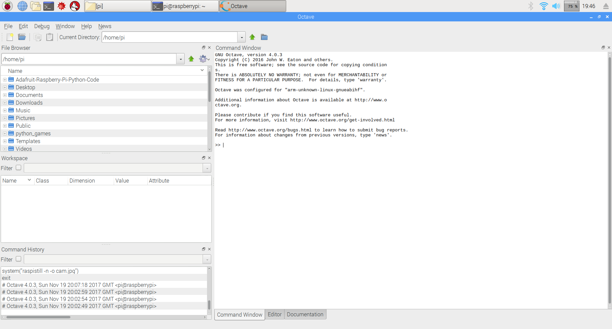
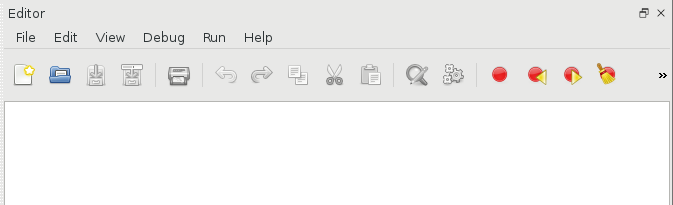
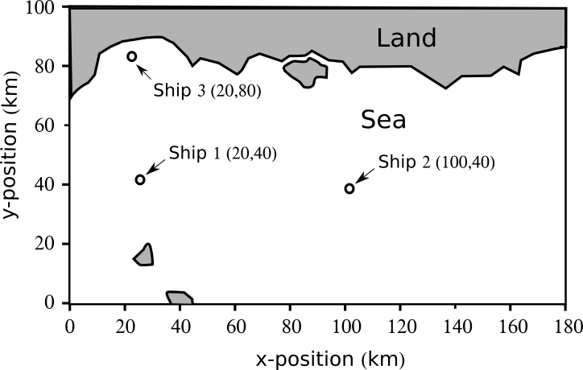

Lab 2
===========

MATLAB and the Raspberry PI
--------------------------------------------

> Virtual lab: If you are doing the virtual you can just use MATLAB on your PC instead of octave or access MATLAB via the virtual Engineering Desktop.

**Step 1.1:** Until now you have only programmed in the MATLAB programming language, although MATLAB it’s self is quite useful, it has some drawback:

1. It’s really really expensive, and to make sure the developers get their money for it, every time MATLAB starts, it checks a license server to see if you are allowed to use it (and if you have paid your money!).  This is non ideal for a non internet connected buggy.

2. It’s really memory/disk intensive, and although the PI is quite powerful, it would struggle with MATLAB.  Even my i7-Intel laptop sometimes struggles with MATLAB.

Luckily for you, there is an alternative to MATLAB which is free and does not have any of the above drawbacks.  It is called Octave, it’s is much less memory intensive and will run easily on our Raspberry PIs just fine. It works just like just like MATLAB, and you will feel quite at home using it.
To start Octave, click on the Raspberry, in the top left hand corner of the screen, go to Education and click on Octave, you should get something looking like Figure 1.1  Think of Octave as free/open source MATLAB.

<p align="center">


Figure 1.1: Octave running on the PI. Personally, I really like Octave and prefer using it to MATLAB.
</p>


**Step 1.2:** Basic use of Octave

Just to make you feel at home with Octave, we will now use it to write some basic computer code, just as we did when we first started learning MATLAB.

> Virtual lab: If you are doing the virtual lab you can skip questions a-e because you will be using MATLAB on a PC.

a) Generate a 10x10 random array of numbers.

b) Define an array of an array called student_marks equal to [ 10 20 30 40 50 60 70 80 90]

c) Set variable 'b' equal to the 2nd element of student_marks, and the variable ‘a’ equal to the third element of the array student_marks.

d) Calculate the average of the variables a and b.

e) Replace the 5th element of the array with 80.

See it’s just like MATLAB. :)

Exercises a-e are just warm up exercises, the will not go into your uploaded zip folder.
 
**Step 1.3:** Scripts in Octave, just as in MATLAB, you can make scripts in Octave.  To make a new script, click file→New→New script.  You will see a script appear on the right hand side of the screen.  A new menu has appeared looking like figure 1.2.


<p align="center">


Figure 1.2: The octave script editor.
</p>

Click, File→Save as and then save the file as 'q1.m' under /home/pi/ .  On the PI, all users home directories are stored under /home/, and you are logged into the system under user ‘pi’, so you save all your work in /home/pi/.  Note that the '/' character is used to separate file and folder names, rather than the '\' character as in windows.  It is also worth noting that in Linux, there is no A:, C:, D: ... Z: drive etc, everything appears as a file.  Now in the script use the disp command to print ‘I love programming the PI!’ to the screen.  Then once you have done this, click on the cog icon, with the little yellow play button embedded in it.  Your script will then run.  The output will appear in the command window.  If you can’t see the command window click on the, use the little resize icon (see figure 1.3) to break the script editor out of the main interface.

<p align="center">


Figure 1.3: The resize icon.
</p>

A mini MATLAB test to get things going..
-----------------

The following exercise refreshes/tests your knowledge of MATLAB, especially functions and files.  You can view the rest of this work sheet as an assessment on how much you have learnt from lectures 1-10 of the MATLAB course.  If you struggle with these, go and revise MATLAB a bit more.  Myself and the demonstrators are also happy to help you with your questions in the lab.

### Exercise 1


**Question 2.1:** Make a new script called q2_1.m, now edit your script so that it will sum the numbers from 1 to 1000, using a for loop.

**Question 2.2:** Make a new script q2_2.m, using a *while* loop make it count from -10.0 to 0.0, in steps of 0.5.

**Question 2.3:** Write a script which sorts an array of 10 random numbers.  Hint: The answer’s in the lecture notes, then save it in file q2_3.m.

**Question 2.4:** Write a script to integrate, the function sin(x)+0.1*sin(x) between -pi and pi.  and save it as q2_4.m.

**Question 2.5:** Write a script to plot a graph of sin(x)+cos(x) between -pi and pi, label the axes using code, and save it as..  Include a copy of the plot in your report.

```
From now on all scripts should be saved as q[Worksheet number]_[question number].m.  If we can't identify the question to which your code relates you will get no marks for it.
```

**Question 2.6:** Write a scrip to write the number from 0 to 10 in a file called save.dat, using *fopen*, *fprintf*, *fclose*...

**Question 2.7:** Write a function called add_me to add two numbers together and return the answer.

**Question 2.8:** Plot a graph of x<sup>3</sup>+x<sup>2</sup>+2x, between -pi and pi.


### Exercises 2

**Question 2.9:** Copy and paste the code into a new script, and add a comment to each line to describe what it does, then comment on the overall meaning of the code, at the bottom of the script.

```
clear
r=rand(15,1)
for i=1:15
  for ii=1:15
    if (r(i)>r(ii))
     temp=r(i);
     r(i)=r(ii);
     r(ii)=temp;
        end
    end
end
disp(r)
```

**Question 2.10:** Copy and paste the code into a new script, and add a comment to each line to describe what it does, then comment on the overall meaning of the code, at the bottom of the script.
```
dat=load('data.dat')
a=dat(:,1)
b=dat(:,2)
s=size(a)
s=s(1)
out=zeros(s,1)
for n=1:s
	out(n)=(b(n+1)-b(n-1))/(a(n+1)-a(n-1))
end
c=[a out]
```

### Exercises 3

**Question 2.11:**  The location of ships in the sea is recorded by a satellite 100 km above the earth and the positions of the ships are transmitted to earth every minute. The locations of the ships are represented by x,y coordinates on a 180x100 km grid  (see Figure 1).  A computer on earth receives the positions of the ships and writes the data to a file called [ship_locations.txt](./ship_locations.txt).    Each line in the file holds the position of one ship. The file has two columns of data, column 1 holds the x position of the ship and the column 2 hold the y position of the ship. When new data is received the file is over written.  

<p align="center">


Figure 1.4: The satellites view of earth. The ships and the x-y grid have been overlaid.
</p>

* Write a Matlab script to read the data file, load the x and y coordinates into array <Cx> and <Cy>. Calculate the number of ships recorded in the file and output this to the screen. Then plot the locations of the ships in a labeled graph using black circles.


**Question 2.12:**  Write a Matlab function <collision> that accepts the position of two ships and then calculates and returns the distance between them in km.  This function should be stored in it's own script file file called <collision.m>. The function collision should have the following format
» d=collision(ship1_x,ship1_y,ship2_x,ship2_y);


**Question 2.13:**  Write a we Matlab script which uses the function collision to check the distance between each ship in the file and prints this to screen.  Use while loops to do this not for loops.


**Question 2.14:**  Change the script so that if two ships are closer than 0.5km it prints the word "Warning!", the locations of both ships and the distance by which they are separated.


**Make sure you make a copy of your code after each lab to USB stick, last year some groups buggies went missing between labs.**

Navigation
-----------------
[<<Lab 1](https://github.com/roderickmackenzie/matlab_robot_buggy/blob/master/WS1/worksheet.md) |
[Lab 3>>](https://github.com/roderickmackenzie/matlab_robot_buggy/blob/master/WS3/worksheet.md)

