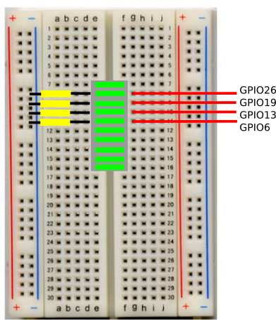

Lab 3 - Output to the real world
=====================================

Motor control - basic output
----------------------------

The buggy has two motors.  These can be used to drive the buggy forwards, backwards or to turn it, by running one motor forwards and one backwards.  By the end of this section you will be able to move the buggy in any direction.

To control the hardware of the buggy, we are going to have to use functions which know how to talk to the hardware.  These functions are stored in the directory ‘/home/pi/lib’ on the pi.  Make a new script called q3_1.m and add the line of code 

```
addpath(‘/home/pi/lib’)
```

to the top of your script, this will tell Octave/MATLAB where the functions to access the buggy are stored.   The functions to access the buggy are stored in a class, you learnt about classes in the preparation material.

*If you are using the emulator on a PC, make sure the path (/home/pi/lib) points to the directory where the emulator code is stored on your computer rather than /home/pi/lib.* So for example if the emulator were stored on your desktop the command should read:

```
addpath(‘C:\users\rod\Desktop\emulator’)
```

[I’m not going to tell you to do this again, I’m going to assume you know this has to be done by you automaticity in every script we write from now on]. If you struggle to do this ask a demonstrator to help you. If you have not downloaded the emulator yet and you are running virtual lab, you can download it (here) [https://github.com/roderickmackenzie/matlab_robot_buggy/blob/master/buggy_simulator/emulator.zip].

If you don't know what a class is go and review the material now.  To control the buggy we first need to initialize an instance of the buggy class like this:

```
my_buggy=buggy_control()
```

This assigns a copy of the class *buggy_control* to the new variable my_buggy.  You can replace the variable my_buggy with any variable you want, *my_amazing_buggy* ,*fred*, *bob*, or *jane*.  It does not matter what it is called. Once you have run your script you should get the words *Buggy initialized!* printed to the screen.

Within this class are all the methods need to access the buggy hardware.

Try adding the command to your script.

```
my_buggy=my_buggy.motors(100,100,1)
```

What happens?  You buggy should have moved forward for 1 second, if it did not move forward but in another direction you probably wired your motors up the wrong way if this is the case just swap the wires around  in the motor driver board.  If you are doing the virtual buggy lab you can virtually change the polarity of the wiring of the motors by adding the commands:

```
my_buggy.pol0=x0
my_buggy.pol1=x1
```

 to your script after you have initialized the buggy_control class for the first time, x0 and x1 should be replaced with a 1 or a -1 depending on if you want to change the polarity of the motors or not.  Experiment with the correct values.

The command to drive the motors is:

```
motors(power1,power2,delay)
```

Power1 and power2 control the power going to the motors, the power must be a number from 0 to 100. The delay is the time for which the motors run.  So for example if you wanted to move the buggy forwards for one second, you would use the command.

```
motors(100,100,1)
```

If you want to run a motor in reverse simply put a minus in front of the motor power.  For example, 

```
motors(-100,-100,1)
```

To stop the motors, use the command:

```
motors(0,0,1)
```

**Question 3.1:**   We are going to write a script to drive the buggy forward two meters then drive it backwards for two meters, then repeat these actions forever.  Edit the script q3_1.m, so that it contains a while loop, which will run for ever (hint: while(1) .... end).  In the while loop, add the motor commands to drive the buggy forward and backwards initially set the time the motors run to be 5 seconds.

> If you are doing the virtual buggy lab drive it forwards and backwards as far as you can without hitting any walls of the enclosure.
```
Hint 1: You will need to use the addpath(‘/home/pi/lib/’) command before these commands will work though.

Hint 2: Position your buggy so the wheels are off the ground, you can use the box your PI came in to do this. If you don’t do this your buggy will fly off the table.
```

**Step 3.1:** Place your buggy on the tool box or some other object so it's wheels are off the ground and not touching anything.  Now click run, and the motors should start to drive forward and then backwards.

**Step 3.2:**  Try not to let your buggy run the motors for too long as it will run down the batteries.  Press ctr+c to stop the scrip running *This will work in the virtual buggy lab too*, then type:


**Step 3.3:**  Now, assuming your script works, re-save you script as /home/pi/autorun.m. Unplug all the cables from the buggy turn it off and place it on the floor.  Turn the buggy on with the power switch, and it should run of batteries. It will take about 30 seconds to boot, but when it does it will run the file autorun.m and your buggy should start going forwards and backwards.

```
Note 1: autorun.m will only be executed, when no keyboard or mouse are present.  If you want to test autorun.m, while the screen is still connected to you PC, just unplug the keyboard and mouse, and /home/pi/autorun.m will be executed.
```

**Step 3.4:**  Tune the timings in your motor commands so that the buggy goes exactly 2 meters forwards and two meters backwards, save your finished script as q3_1.m.  (If you are doing the virtual lab tune the timings so that it covers as much ground in the arena as possible.)

**Question 3.2:**  We are now going to experiment with making the buggy turn, after this exercise the buggy will be able to drive in a square, to make the buggy turn you will have to stop one wheel and drive the other forward, you will be able to turn faster by running one motor forward and running one in reverse.  Edit your script so that the buggy drives forward, turns right, moves forward, turns right, moves forward.... etc.... until it has reached it's starting position.  The buggy should move in a square, save this as q3_2.m.


Advanced motor control - non virtual lab only
----------------------


>Skip this section and associated questions if you are doing the virtual lab, for reasons which I will explain in the lab the emulator is not able to emulate the advanced motor commands.

The commands you just used to control the motor are simple, and work effectively.  The drawback of these commands is that while the commands are running, your code cannot do anything else.  There is another more advanced motor control command that enables you to do other things while the motors are running.  This command is

```
motors_adv(power,power)
```

If you issue this command the motors will start, and just keep running.  Notice there is no timing command, thus once you turn the motors on you will have to turn it off by issuing:

```
motors_adv(0,0)
```

Often when controlling hardware there are various versions of commands, some easy to use and some harder with more power.

**Question r3.3:**  Notice that in the previous examples, when you issued the command motors(100,100,5) command the buggy did a wheely.  This because the buggy is slightly heavier towards the back and has a lot of motor power.  We are now going to write two functions to gently ramp the power of the motors when setting off, so that it stops the buggy doing a wheely.  Make a new script called start_now.m and using a for loop and the motors_adv command, ramp the power of the motors from 0 to 100, over a period of 10 seconds.

**Question r3.4:**  Now make a new script called stop_now.m and make the function ramp the power of the buggy from 100 to 0 over a period of 10 seconds.

**Question r3.5:**  Turn you scripts stop_now and start_now, into functions so that they can be called from a third script q3_5.m.  Edit your script q3_5.m, so that it starts the buggy slowly, runs the motors for three seconds, then slowly decelerate the buggy.  You should use the functions you generated in the previous sections.


**Question r3.6:**  Now edit your script called q3_5, so that it gradually starts moving the buggy, then runs the motors on 60 percent power for 5 seconds, then gradually stops it.  What do you notice?

**Question r3.7:**  You should have noticed that the buggy accelerated from a standing start to 100% power, then as you ran the motors_adv(60,60) command, it suddenly slowed down, next as it was about to decelerate it accelerated to 100% power then slowed to a stop.  The motion of the buggy should have been a bit jerky.  If you had been in a car like this you would get whip lash!  The reason for the jerkiness, lies in your functions stop_now and start_now, always starting and ending at 100% power.  To prevent this you would have to know the current speed of the buggy and start any acceleration at this speed.  The command:

```
get_motors_state()
```

returns an array of size two, the 1st element contains the speed of the first motor, the 2nd element is the speed of the second motor.  Have a play with this command, while the motors are running.

**Question r3.8:**  Make a new script called goto_speed.m.  The purpose of this script will be to smoothly accelerate the buggy from it's *current speed* to a desired speed.

* Make the script start your buggy moving forward at speed 100.

* Then define a variable called *target*, which contains the next desired speed of the buggy, set it's value to 0 as we want to slow the buggy down from 100 to 0.  We are going to slow (or speed up) the buggy in 10 steps over a period of 10 seconds.

*  Subtract the current speed of the buggy from the target speed, to get the difference between it's current speed and the desired speed, you can find the current speed with the function *get_motors_state()*.  Now divide this number by 10, and store the result in a viable called *ds*.  The variable *ds* tells us how much to speed the buggy up or down each step to arrive at the desired speed after 10 steps.

* Write a while loop to count from the current speed to the desired speed in steps of *ds*, use the variable *current_speed* to store the current speed of the buggy, display this variable to the screen.

* Next insert a sleep command to make the loop pause for 1 seconds each time it runs.

* Finally add the *motors_adv* command to the loop, so that the variable current_speed is sent to the motors.  After completing these steps, your buggy should start moving the decelerate from 100 to 0.  Now change the initial speed to 70 and see what happens.


**Question r3.9:**  Make the script goto_speed into a function, and add an input parameter into the function definition which allows the user to choose the number of steps taken to reach the desired speed.  Generate another script which called q3_9.m, this script should use the function goto_speed to do the following:

* Accelerate the buggy from a standing start to 100% speed over a period of 10 seconds.

* Gradually reduce the speed to 50% power over a period of three seconds.

* Rapidly accelerate to 100%, then remain at this power for 4 seconds.

* Suddenly stop.

Advanced motor control - virtual lab only
----------------------
**Question v3.3:**
In the real world you would be able to move chairs around the room to make an obstacle course for your buggy, you would also be able to move objects out of the way to make your task of programming the buggy easier.  In the virtual world, the course is generated by the commands in the file buggy_control.m.  Open this file up and you will see that there are six sets of objects used to make the virtual world.  Using the % command and trial and error comment out the lines of code which produce the large square in the centre of the course.  Each set of three lines of code initializes a new class then adds it to the list of objects which make up the scene.  This a very simple example of building a virtual 3D world.

**Question v3.4:** Now try to change the color of the objects in the virtual world.  Again you don't know how to do this but try to figure it out.

**Question v3.5:**
Make a new script called q3_5.m and try to make your buggy drive in a figure of 8.  Try to make it as curvy as possible and as big as possible.  Now place two obstacles in the centre of the figure of 8s. (note you will also have to upload your edited buggy_control.m file to get the marks)


Controlling output pins on the PI
---------------------------------

So far you have used relatively high level commands to control the motors, hidden behind these motor commands is quite a lot of [complex code](https://en.wikipedia.org/wiki/Pulse-width_modulation).  However, very often you will need to be able to turn and off individual outputs from a computer.  You might for example want to detonate a warhead, activate an air bag or turn on some lights.  To do these type of actions you must understand how to control voltages on the output pins of a computer.  In this example we will be controlling an LED bar graph, although you could replace the LEDs with any component you wanted to drive.

**Step 1:**  Find in your tool box, the LED bar graph component and wire it into your circuit board as shown below. The resistors should go into the black/blue strip.  Then connect the other side of the LEDs to the PI using the jumper cables, refer to Figure 2 to understand which pins on the PI the LEDs should be connected to, these pins on the PI are called GPIO pins or general-purpose input/output pins.

**Question 3.10:**  Which GPIO pins are the motors connected to?  Save this as a comment in a script called q3_10.m.

<p align="center">


Figure 1: The LED bar graph wired into the bread board.
</p>

<p align="center">


Figure 2: The pin out of the PI.
</p>

**Question 3.11:** The resistors are used to limit the current flowing thought the LED, so that it does not burn out.  If you don't use the resistors, then the LEDs will glow very bright for a few moments before getting dim and permanently breaking (don't do this!).  If the PI supplies 3.3V from it's output pins and the resistors have a value of 330 Ohms pins, how much current will flow through the LED when turned on?  Does it matter which way around the LED is placed?  Save this as a comment in a script called q3_10.m.

 **Question 3.12:** Draw a circuit diagram of the LED, raspberry PI (you should represent this as a 3.3 V battery), the resistor label all the voltages and currents in the circuit.  Save this as q3_12.jpg

**Question 3.13:** Using the web/youtube learn how the color codes printed on resistors can tell you what value they are.  Use [this](http://www.resistorguide.com/resistor-color-code/) guide to write down the color codes you would expect for a 1k Ohm and a 1 Mega Ohm resistor, save these values in the script q3_12.m.

<p align="center">


Figure 3: Examples of resistors.
</p>

**Step 2:** Now the LEDs have been connected, the pins can be turned on with the command

```
my_buggy=my_buggy.gpio_write(GPIO_PIN_NUMBER,1)
```

and can be turned off with the command
```
my_buggy=my_buggy.gpio_write(GPIO_PIN_NUMBER,0)
```

**Question 3.14:** Make a short script called q3_14.m to turn all four LEDs on then wait one second then turn all the LEDs off.  If it does not work, you have probably connected your LED block the wrong way around, just lift it off the board rotate it through 180 degrees and plug it back in. [LEDs only work one way around, I did not tell you this before, because there was a 50% chance of you plugging it in the right way :)].

**Question 3.15:** Edit your script so that the LEDs will flash on and off with a one second interval for ever. 

**Question 3.16:** Now make a new script to turn your LEDs on/off randomly at regular intervals of 0.5 seconds, save this as q3_16.m

```
Hint, first pick a random number between 1 and 4, then use an if-elseif-end statement, to turn the on a given pattern of LEDs depending on which random number was chosen.
```

**Question 3.17:** Make a new script called 3_17.m with a comment in the top of the script called with the words 'knight rider!' on it.  Make the active LED bounce backwards and forwards along the display, as shown in this [video](https://www.youtube.com/watch?v=hG44lIO_bss) :).  This can be done with a while loop,  the set_pin command and the wait command. [If you’ve not seen the TV program... you’ve missed nothing. :) ]


**Question 3.18:** Finally today, we are going to combine moving the buggy with flashing the LEDs, so we will be combining two types out output.  Write a script to move the buggy forward about 10 meters while displaying the knight rider effect on the LEDs, then stop the buggy. (If you are doing the virtual lab edit make your buggy move in a square and every time it turns get it to do the night rider effect.)


Controlling the PI it's self - and power management
---------------------------------------------------

Robots not too dissimilar to yours are used to explore remote planets such as [mars](https://mars.nasa.gov/mer/).  Such a robot would be a long way from  Earth, and there is a limited amount of power available.  For example, in summer there may be enough power to run the computers, cameras, and communications equipment in the robot, however in winter, the robot may have to power down to save power.  Power management is a serious issue in robots and computers.  Octave on the PI has the command:

```
my_buggy.poweroff()
```

Which will turn the main computer of the buggy off to save power. Add this command to the end of your script from the above section so that after the robot has completed moving 10 meters it turns off.


Developing yourself as an engineer
----------------------------------

For a good engineer, engineering should be as much a hobby as a profession.  You should continually be trying to improve your skills every day both in your free time and when working.  You should think of computing and electronics as a fun thing to do and try to explore it on your own.  There is not enough time in 3-4 short years of lectures to teach you all the skills you will need in your professional lives.  Why don't you try:

* Learning Python in your free time: Here are some good links to get started: [Downloading and installing](https://www.python.org/about/gettingstarted/), [Watch youtube channels on Python](https://www.youtube.com/watch?v=cpPG0bKHYKc), [tutorials](https://wiki.python.org/moin/BeginnersGuide/Programmers)

* Why not buy a book to learn to program python.
 
* Subscribe to some electronics youtube channels, this one is quite good [mikeselectricstuff](https://www.youtube.com/channel/UCcs0ZkP_as4PpHDhFcmCHyA), and so is this one [EEVBlog](https://www.youtube.com/user/EEVblog).


Navagaion
-----------------
[<<Lab 2](https://github.com/roderickmackenzie/matlab_robot_buggy/blob/master/WS2/worksheet.md) |
[Lab 4>>](https://github.com/roderickmackenzie/matlab_robot_buggy/blob/master/WS4/worksheet.md)
