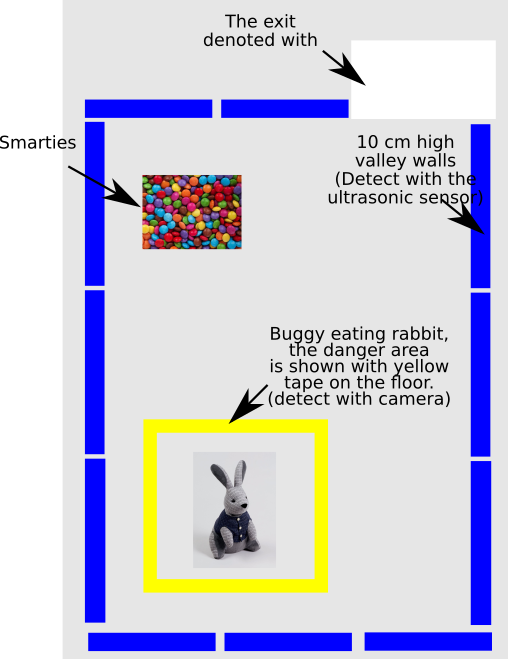

Worksheet 3
===========
Wile group work is fun, it’s also fun to do your own thing.  So for this worksheet, all parts are to be done individually, except Question 1 which you will have to do in a group. The usual plagiarism rules will apply for all but question 1. As ever, the demonstrators in the lab are here to help you.  For all questions but number 1, you can use matlab on the computers in C19/C20, you don’t need the buggy.

Question 1
----------
You will have noticed that your buggy has a camera.  In this worksheet we will be using the camera to detect objects and ultimately, to help the buggy avoid objects (although that will be in the next lab).

> Note: Most of you have not finished work sheet 2 yet, so my suggestion is to first do question 1, get the images then have a go at this work sheet during the week.  The demonstrators will be able to help you next week.

**Step 1:** Make a new octave (MATLAB) script, add the addpath(‘/home/pi/lib’) command as usual. Then add the command camera() to the script. Save and run the script and you will see that an image has been written to /home/pi/image.jpg .  To open this image, click on the folder icon in the top left of the screen (it is the third icon from the left, next to the raspberry).  If you now double click on image.jpg you will see a picture of what the camera was looking at.

**Step 2:** Now, put the buggy on the floor, with all the wires still plugged in. Make sure the buggy has a clear view of the floor, with no wires, cables, bags books etc.. in the way. Then take another image using  your script.  Rename the image by right clicking on it, and call it ‘floor.jpg’.

**Step 3:** Next lab session your buggy will have to navigate an obstacle course, see figure 1.  Your buggy will have to find the exit (marked by a white piece of paper), avoid being eaten by the rabbit, which is lives in an area surrounded by black tape, avoid bumping into the walls, and ideally avoid the patch of Easter eggs before exiting the course.  These tasks can be accomplished by using a combination of the camera and the ultrasonic sensor.

Figure 1: An example of the buggy course.

However to do this task we need sample images of the black tape, smarties and the white piece of paper.  Ask Rod (or a demonstrator ) for these objects.  Take pictures of each of the objects with the buggy camera naming them black.jpg, eggs.jpg and exit.jpg.  [Hint: I would not eat the smarties… they have spent quite a long time kicking around my office!]

**Step 4:** Insert a USB stick into the PI, and copy off the images to a USB stick.  If you  can’t work out how to do this, ask a demonstrator.  We will be using these images in the rest of the questions.

The rest of the work sheet will be individual work, not group work, done on the PCs in the computer room, on your laptop or at home.  (Usual plagiarism rules apply... sorry) When you finished the programming your code, we will copy your files back to the PI, and test them.

Question 2
----------
Start up MATLAB on your PC.  We are now going to write some simple code to do some image recognition.  The image recognition will be based on color detection.  In a new script called q1.m use the imread and imshow command to read in the image and display the image of the floor.  What do you notice about the image?  Use the manual to look up what the flipud command does.  Have a go at using it.  What does it do to the image?  Save this script as q1.m

Question 3
----------
**Step 1:** We are now going to write a function to calculate the average color of a image.  If you can’t remember how functions work, revise this section in your notes.  Make a new MATLAB file and save it as *get_color.m*.  In this file we are going to make a function, copy and paste the following code, which will define a function into the file:

~~~~
function [r g b] = get_color(data)
r=1;
g=2;
b=3;
end
~~~~

Save your file *get_color.m* then from then on the command line type

~~~~
[r g b]=get_color(1)
~~~~

What values does this function return?  Change the function so that it returns r=5, g=6 and b=7. 

**Step 2:** Color images are made up of pixels, each pixel has a red, green and blue component, the values of the red, green and blue components can range form 0 to 255.  So for example, a very red pixel would be represented by the three numbers 255,0,0 or a very green pixel would be represented by the three numbers 0,255,0 and a blue pixel would be represented by the values 0,0,255.  What value would a black and gray pixel be represented by?

Have a play with this web page to understand this a bit better:
[web page](https://www.w3schools.com/colors/colors_converter.asp)  What are the RGB values of your favourite color?  Look up the RGB values for purple and save them in your script as a comment.

**Setp 3**: By looking at the color components of any image 
we can guess what could be in the image.  For example if the image is of the floor in the L3 lab, it will consist of lots of gray pixels.  If the image is full of colorful Easter eggs, it will have a wide range of colors etc...

We would like our function get_color(x) to return the average color of the pixels.

Question 4
----------
**step 1:** Rather than calling your get_color(x) function from the command line, make a new script called  *detect.m*, and in that script call you function by adding the line of code:
~~~~
get_color(1)
~~~~

**step 2**: Currently we are passing the get_color function the value of 1,  we don't want to do this we would like to pass it an image from the camera.  So using imread in the script *detect.m*, read the image *floor.jpb* into a variable *a* and pass it to your function by using the code

~~~~
get_color(a)
~~~~

Now in your *get_color()* function use the command *imshow*, so that the function will display any image which is passed to it.

**Step 3:** We now need to define two nested loops to iterate over every pixel in our image.  For now we are going to pretend our image is 100x100 pixels big.  Inside the function *get_color*, underneath your *imshow* command define two nested for loops, one which counts using the variable x from 1 to 100 and one which counts using the variable y from 1 to 100.  If you can't remember what a nested loop is refer to your notes.

**step 4**:  Using the *sprintf* and the *disp* commands print out all the values of *x* and *y*, over which the loops count.

**step 5**:  We know that this image is bigger than 100x100 pixels.  Use the *size* command to store the *x* and *y* size of the image in the variables *x_len* and *y_len*.  Change your for loops so rather than counting to 100, they count to x_len and y_len.

**Step 6**:  In the CW2 we played with a black and white (sometimes called gray scale) image of the science museum.  We learnt that gray scale images are stored in a 2D matrix, with a value between 0-255 representing the value of each pixel. Zero represents the color black and 255 represents the color white, and all values between being shades of gray.  If one wanted to extract the intensity at 50,50 pixel form an image stored in the array *data*, we would use the code:

~~~~~
data(50,50)
~~~~~

However our image is not gray scale it is a color image.  In Color images as I mentioned above we store red, green and blue pixels.  Therefore at each position in the image there is a red green and blue value stored.  To access the red value at 50,50 we would use the command

~~~~~
data(50,50,1)
~~~~~

To access the green value we would use the command:

~~~~~
data(50,50,2)
~~~~~

and to access the blue value we would use the command:

~~~~~
data(50,50,3)
~~~~~

Edit your *sprtinf* statement to display the red, green and blue values of the pixels at every x,y value your nested for loops count over.

Question 5
----------
**Step 1:** We are now going to edit the function so that it sums, all the values of the red pixels in the the image. First delete the lines:

~~~~
r=1;
g=2;
b=3;
~~~~

from your function.  At the top of your function define the counter r=0.0, in the loop add the line 
~~~~
r=r+int32(a(x,y,1));
~~~~

By writing int32 before the a, we are just telling MATLAB/Octave to use an int32 type variable to store the sum of all the red pixels.  An int32, is a special type of variable which can store very big numbers, we are using this as we expect the value of r to get very big.  The technical term for this is type casting.  Now add corresponding lies for the blue, and green colors, just as we did for the red color.  After your loop add the commands:

~~~~
r
g
b
~~~~

To show you the totals of the red green and blue in the images.
Now test out the function again on the command line.  You should get some large values for r,g and b returned.

**Step 2:** Returning the sum of red, green and blue, pixels is not so useful. What we want really is the function to return the average values of the red, green and blue pixels.  So add to your function a variable (called count) which adds up the number of pixels over which the r,g,b values are summed.  Then at the end of your function, divide r,g and b values by count.  [An alternative way of doing this is to divide the totals by y_len*x_len] Test your function again by running the script, detect.m.  It should now return the average pixel intensity, for the region defined in figure 1.

**Step 3:** Change your script *detect.m* to load *black.jpg* and *smarties.jpg*.  What values do you get out?  Are they different for each object?  If so how different?

Question 6
----------
**Step 1:** We have now written a function to detect the color of an object.  All we need now it to change our program to figure out which color relates to which object.  Depending on the light the exact values from the camera may change so rather than saying the average color from a section of black tape is 0,0,0 we could say that black tape has values of red<50 and green<50, blue<50.  I would use this code to check if an object is black or not:

~~~~
if (r<50)
    if (g<50)
        if (b<50)
           disp("The object is black!!")
        end
    end
end
~~~~

copy and paste this code into *detect.m*.  Does it work?  Copy and paste this code, while changing the values to detect the color white representing the exit.  Does it work?

Question 6 (bonus question):
----------------------------
Can you detect the image with the smarties in it.  Can you think of original strategies for doing this?

