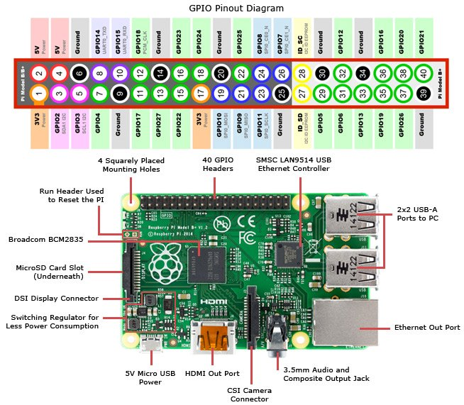

Worksheet 4 - Getting input from the world
==========================================

So far we have spent time getting the buggy to move by using the computer to control external lights and motors, in this worksheet we will focus on getting the computer to get input from the real world so it can understand what is happening around it.

The echo sensor
---------------
The buggy is equipt with an echo sensor, this sends out an ultra sonic pulse and waits for it to bounce off an object.  By timing the time between the pulse being sent and the pulse being received again by the sensor we can calculate the distance to an object.

<p align="center">


Figure 4.1:  How echo sensors work. 
</p>

**Question 4.1:** Make a new script called q4_1.m as usual add the 

```
addpath(‘/home/pi/lib’)
```

command to the script then, under that add the line, write


```
echo_sensor()
```

and run the script.

* Try placing your hand in front of the echo sensor and then moving it away, how does the number change? If the number does not change, or you get a minus number check the wiring on your echo sensor very carefully.  If all else fails call a demonstrator over for help.

* Using a while loop and the sleep command, make Octave print out a distance measurement every second.  Something funny happens, when you run this script.  It will only show you the output once the script ends (remember ctrl+c ends scripts).  Octave does this, to make the program quicker to run [MATLAB does not do this], printing text to the screen is very slow.  However, sometimes it is useful to see the text generated by our program as it runs.  To force Octave to print out text, as the program runs add the command

```
fflush(stdout)
```

just after the command used to print the distance, this will force Octave to show you the text is has just printed.

**Question 4.2:** Edit your program so that it prints out the words "Too close!", when you hold your hand less than 5 cm front of the sensor, "I miss you!", when your hand is not there, and “Just right”, when your hand is 10-15 cm away. Save this all under q4_2.m


**Question 4.3:** Use the LED bar graph to show you the distance your hand is from the echo sensor.  For 0-5cm turn on one LED, for 5-10 cm, turn on 2 LEDs, for 10-15 cm turn on 3 LEDs and bigger than 20 cm turn on all four LEDs.  Save this as ws4_3.m  What is the range of the echo sensor?  Give this value in your report.

**Question 4.4:** Binary numbers, in this question you are going to use the internet to find out what binary numbers are.  [This video](https://www.youtube.com/watch?v=Z6cSiP93nos) explains what binary numbers are, if that is not enough to understand binary numbers then use the wider internet.  Make your LED bar graph display the distance to an object to the nearest 10 cm, in binary.  Notice in this question, I'm not telling you exactly how to do it, and letting you go off and find things out on your own.  When working in industry you will often have to self educate to solve a problem. [But if you get stuck do ask.]

**Question 4.5** We are now going to use the echo sensor in combination with the the motors to enable the buggy to detect an object and avoid it.  Make a new script to drive the buggy forwards, if it sees an object less than 50 cm away, it should stop rotate by 180 degrees, and then start driving forward again.  When the buggy is moving forwards it should display the knight rider effect on it's LEDs.

Copy your answer to this question to the autorun.m file, and test the buggy on the floor.


Switches
--------

Ask a demonstrator (or me :) ) for a ‘block of red switches’, I have not put these in the kits as the pins get damaged very easily.  In this final section to the work sheet, we are going to be using the switches to get input from the outside world.  Again, just like with the LEDs, these switches could be replaced with any type of sensors, gas sensors, light sensors, heat sensors, you name it you can connect it to the PI.  However, to keep things simple we are first going to play with simple off on switches first.

<p align="center">


Figure 1: Adding the switches to the bread board.
</p>

<p align="center">


Figure 2: The pinout of the PI.
</p>


Wire up the switches according to the wiring diagram in figure 1, if you get lost ask a demonstrator for help.  The yellow boxes are resistors, they are the same as the 330 Ohm ones you used for the LEDs.  I have again included a in figure 2 a pin out of the PI.

Once the switches are installed you can read their state using the

```
pin_in()
```

function in octave, this returns a 1D array containing the position of the switches.  Try playing with the switches and see what pin_in() returns.

**Question 4.6:**  We are now going to edit the script in question 4.5 to use the switches to select the speed of the buggy.  If the script is run with switch:
* **number 1 on** The buggy should flash all it's lights on and off forever at a rate of once per second, and not move.
* **number 2 on** The buggy should behave as in question 4.5 except be limited to a speed of 50.
* **number 3 on** The buggy should behave as in question 4.5 except be limited to a speed of 80.
* **number 4 on** The buggy should behave as in question 4.5 except be limited to a speed of 100, and every so often randomly stop and rotate through 270 degrees.


