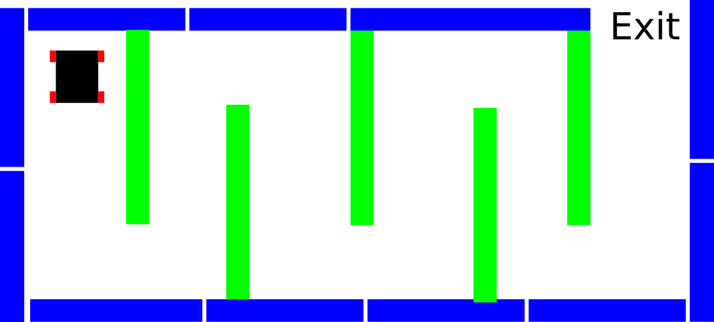
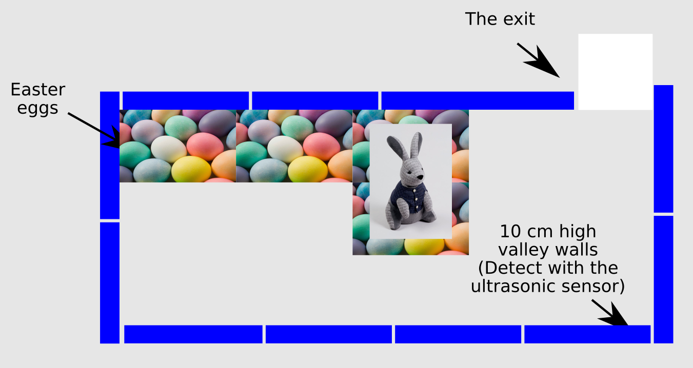

Lab 6
===========

The Easter Rabbit Buggy challenge - virtual lab
---------------------------------
**Question v6.1:**  By editing the file buggy_control.m build the virtual course which is depicted in figure 6.1. Place your buggy at a *random* position on the left of the course then, write code to enable the buggy to escape the maze using it's echo sensors alone.  The buggy can not take a pre-programmed course out of the maze.

Figure 6.1: An example of the virtual buggy course

The Easter Rabbit Buggy challenge - real lab
---------------------------------

**Question r6.1:**  Your buggy is trapped in a valley, where a rather large rabbit called Rudolf lives who likes.  It's not quite Easter, so Rudolf has not had any chocolate eggs this yet this year, so your buggy is in danger of being nibbled if it bumps into Rudolf.  Your buggy must find the exit to the valley without bumping into the valley walls, or encountering the rabbit.  If your buggy bumps into the walls of the valley it must take a time out of 30 seconds (the demonstrator will pick the buggy up and remove it from the course) then restart the course from the beginning.  Use the echo sensor to avoid the walls.  A diagram of the course is shown below:

Figure 6.2: An example of the buggy course.

The rabbit lives in an area surrounded by Easter eggs, if the buggy detects Easter eggs on the floor it should reverse and then turn around and continue trying to find the exit to the valley.  The exit to the course is denoted by a white piece of paper on the floor - detect this with your camera.  If your buggy bumps into Rudolf, he has to sit out the buggy challenge for 10 min to be repaired.

As a group, edit your buggy code so that your buggy will search for the exit as quickly as possible without bumping into the rabbit or hitting a wall.  Rules of the game:

* The buggy must find the white piece of paper to win the game.
* It must sit out the course for 10 min.
* Your buggy must avoid mountains (plastic boxes) and valley walls (detonated by the barrier), your buggy will be removed from the course for 30 seconds.
* By avoiding the area with Easter eggs you will avoid the buggy, use your camera to recognize Easter eggs.

How you achieve this aim is up to you. Here are some ideas of how to solve the problem:

- Use your answers to the previous work sheets to detect the Easter eggs and the bunny.

- Move the buggy randomly, until it sees the white piece of paper *or* a systematic search for the exit.

**Question r6.2:**  In your report plot graphs of:
* The speed of the left wheel.
* The speed of the right wheel.
* The distance the echo sensor records.

These should all be plotted against time.  Hint use the fprintf, fopen and fclose commands to accomplish this.

* Make a table showing the first 20 images the camera took during the course, and annotate them with any actions your code may have taken at the time.

**Question r6.3:**  For extra marks, do something creative, original, and technically interesting with the buggy hardware.

